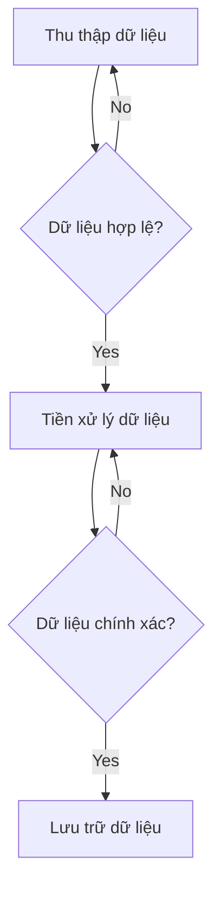

> Tìm hiểu cụ thể, có hệ thống hơn về Big Data

## 1. Big Data là gì ?

> [!check] 
> Big Data chỉ các tập dữ liệu lớn, phức tạp và đa dạng (khó quản lý bằng công cụ và phương pháp truyền thống.)

> [!abstract] Các đặc tính
> 
> * **Khối lượng dữ liệu** 
> * **Tính đa dạng**
> * **Tốc độ xử lý**
> * **Độ chính xác dữ liệu**
> * **Bảo mật**
> * **Tính khả diễn giải**

### 1.1 Khối lượng dữ liệu

* Khối lượng dữ liệu trong Big Data rất lớn
  * Thường từ vài TByte -> PByte.
* Vượt quá khả năng xử lý của các công cụ và phương pháp truyền thống.
* Giúp chúng ta có cái nhìn chi tiết hơn về nhiều khía cạnh khác nhau của thế giới.

> [!question] Các công cụ truyền thống được nhắc tới là gì?
> 
> * Cơ sở dữ liệu quan hệ (Relational Database)
> * Hệ thống tập tin, file truyền thống
> * Các công cụ phân tính thống kê thông thường (Excel, IBM SPSS ...)
> 
> **->  Các công cụ và phương pháp này có giới hạn về khả năng xử lý dữ liệu lớn và đa dạng như trong Big Data. Vậy nên chúng ta cần các công nghệ và phương pháp mới để xử lý dữ liệu lớn, phức tạp và đa dạng hơn này.**

* Việc lưu trữ một lượng dữ liệu đòi hỏi nhiều không gian lưu trữ, phần cứng mạnh mẽ và các hệ thống quản lý cơ sở dữ liệu có thể chia tách và phân tán dữ liệu nhằm đảm bảo hiệu suất tốt nhất

> [!warning] Việc sử dụng RBMS là không phù hợp với Big Data.
> 
> * **Không khả thi về mặt kinh tế**: 
>   * Dữ liệu có thể tăng lên hàng tỷ, trăm tỷ bản ghi -> đòi hỏi nâng cấp về mặt phần cứng để đáp ứng hiệu suất xử lý tương ứng.
>   * Tuy nhiên, việc nâng cấp phần cứng đòi hỏi chi phí đắt đỏ, không phù hợp với các tổ chức có ngân sách hạn chế.
> * **Không thể xử lý dữ liệu phi cấu trúc:**
>   * các rdbms được thiết kế để xử lý dữ liệu có cấu trúc và rõ ràng (bảng, trường, quan hệ)
>     -> Không thể giải quyết được các dữ liệu phi cấu trúc (từ các ứng dụng web)
> * **Không thể mở rộng dễ dàng:**
>   * Khi kích thước dữ liệu  tăng lên RDBMS không thể mở rộng dễ dàng để đáp ứng nhu cầu của các ứng dụng dữ liệu lớn.

### 1.2 Tính đa dạng

* Liên quan tới việc xử lý và phân tích ***dữ liệu phi cấu trúc***.
* Với tính đa dạng của dữ liệu, Big Data trở nên phức tạp và khó để xử lý cũng như phân tích. 
* Các dạng dữ liệu khác nhau yêu cầu các công cụ và kỹ thuật khác nhau để trích xuất thông tin và cung cấp giá trị cho người dùng.

> [!info] Dữ liệu phi cấu trúc (Unstructured Data)
> Các dữ liệu không được tổ chức hoặc định dạng theo các quy tắc cấu trúc nhất định. (văn bản, hình ảnh, âm thanh, video, dữ liệu mạng xã hội)

| **Dữ liệu cấu trúc**                                                                                          | **Dữ liệu phi cấu trúc**                                                                   |
|:------------------------------------------------------------------------------------------------------------- |:------------------------------------------------------------------------------------------ |
| Có cấu trúc xác định trước                                                                                    | Không có cấu trúc xác định trước                                                           |
| Thường được lưu trữ trong các bảng hoặc tệp tin                                                               | Các định dạng dữ liệu khác nhau  văn bản, hình ảnh, video...                           |
| Có thể được quản lý và truy xuất   bằng hệ thống RDBMS và SQL                                             | Không thể bằng các công cụ truyền thống                                                    |
| Dữ liệu được xác định trước với các định dạng dữ liệu nhất định  (String, Integer, ...)                   | Dữ liệu không có định dạng nhất định                                                       |
| Thường được xử dụng cho các ứng dụng kinh doanh truyền thống  (quản lý khách hàng, báo cáo tài chính ...) | Sử dụng cho các ứng dụng phân tích Big Data   và các ngành công nghiệp mới như AI, IoT |

> [!note] Các nguồn dữ liệu của Big Data
> 
> 1. Dữ liệu từ Internet: web, social network, blog...
> 2. Dữ liệu từ các thiết bị di động: smartphone, smartwatch ...
> 3. Dữ liệu từ các cảm biến và thiết bị IoT: cảm biến nhiệt độ, ....
> 4. Dữ liệu từ các tổ chức: bệnh viện, tổ chức tài chính, tổ chức chính phủ, công ty ...

### 1.3 Tốc độ xử lý

* Được tạo ra từ các nguồn khác nhau, liên tục
  -> Việc xử lý nhanh chóng và hiệu quả là rất quan trọng, phải đảm bảo rằng dữ liệu được xử lý và phân tích trong thời gian ngắn nhất để có thể đưa ra những quyết định kịp thời và hiệu quả.

> [!abstract] Các yếu tố ảnh hưởng tới tốc độ xử lý
> 
> 1. Cơ sở hạ tầng phần cứng
> 2. Lưu trữ dữ liệu
> 3. Độ nén dữ liệu
> 4. Độ phân tán dữ liệu
> 5. Xử lý song song
> 6. Luồng dữ liệu
> 7. Làm sạch và tiền xử lý dữ liệu
> 8. Lấy mẫu dữ liệu

#### Cơ sở hạ tầng phần cứng

* Phụ thuộc vào kích cỡ cũng như độ phức tạp của dữ liệu sẽ được xử lý.
* Cần sử dụng một máy chủ hoặc cụm server với nhiều bộ xử lý, kết nối mạng tốc độ cao và lưu lượng bộ nhớ lớn để tăng hiệu suất xử lý.

#### Lưu trữ dữ liệu

* Hệ lưu trữ phân tán cho phép chia nhỏ dữ liệu thành các khối (blocks) và phân tán ra nhiều nút (nodes), cho phép tốc độ truy nhập cũng như xử lý dữ liệu nhanh hơn
  * Ex: Hadoop Distributed File System - HDFS
* Dịch vụ lưu trữ đám mây cung cấp khả năng mở rộng nhanh chóng.
  * Ex: Amazon S3, Azure Blob Storage

#### Độ nén dữ liệu

* Giúp giảm kích thước của dataset.
* Mức độ nén dữ liệu cần cân bằng với sức mạnh xử lý cần thiết để giải nén dữ liệu
* Các thuật toán được sử dụng để nén dữ liệu:  LZO, Snappy

#### Độ phân tán dữ liệu

Ex: MapReduce framework của Hadoop giúp phân tách dữ liệu thành các mảnh nhỏ, sau đó xử lý chúng song song bởi các nodes trong cụm.

#### Luồng dữ liệu

* Cho phép phân tích data ngay lập tức
* Giảm nhu cầu lưu trữ lượng lớn thông tin 
    -> Giúp giảm thời gian cũng như chi phí để xử lý
  Ex: Apache Kafka cung cấp luồng dữ liệu thông suốt và ít độ trễ.

#### Làm sạch và tiền xử lý dữ liệu

* Giúp giảm lượng dữ liệu cần phải xử lý -> tăng tốc độ 
* Các kỹ thuật được sử dụng:
  * Data deduplication
  * Data normalization
  * Data Filtering ...

#### Lấy mẫu dữ liệu

* Việc lấy mẫu một luợng nhỏ dữ liệu trong 1 tập dữ liệu lớn.
  -> Giảm thời gian xử lý, nhưng vẫn cung cấp cái nhìn có ích về tập dữ liệu.
* Việc chọn kỹ thuật lấy mẫu phụ thuộc vào usecase và kích cỡ của tập dữ liệu:
  * Random Sampling (lấy mẫu ngẫu nhiên)
  * Stratified Sampling (Lấy mẫu phân tầng)
  * Cluster Sampling (Lấy mẫu cụm)

### 1.4 Độ chính xác dữ liệu

* Các nguồn dữ liệu khác nhau có mức độ chính xác khác nhau.
* Để đảm bảo độ chính xác của dữ liệu, cần có các quy trình kiểm tra và xác nhận dữ liệu trước khi sử dụng.

> [!note] Quy trình kiểm tra và xác nhận dữ liệu

* Ngoài ra, cần có các quy trình và chính sách để quản lys và bảo vệ dữ liệu.

### 1.5 Bảo mật

* Dữ liệu trong Big Data thường chứa các thông tin quan trọng (thông tin cá nhân, thông tin tài chính, công ty ... ) -> việc bảo mật là vô cùng quan trọng
* Dữ liệu đuợc thu thập từ nhiều nguồn khác nhau, có tính chất đa dạng và khổng lồ
    -> Gây khó khăn, phức tạp trong việc bảo mật dữ liệu.

> [!note] Các yếu tố quan trọng trong đặc tính bảo mật
> 
> * **Quản lý quyền truy cập:** đảm bảo nguời dùng có quyền truy cập được phép vào dữ liệu và chỉ được truy cập vào các dữ liệu mà họ cần.
> * **Mã hóa dữ liệu:** đảm bảo dữ liệu được mã hóa khi được lưu trữ và truyền đi để đảm bảo an toàn và không bị đánh cắp.
> * **Giám sát và phát hiện các hành vi độc hại:** các giải pháp bảo mật phải có khả năng phát hiện các hành vi độc hại và thông báo cho quản trị viên về các mối đe dọa tiềm ẩn.
> * **Backup và khôi phục dữ liệu:** đảm bảo rằng dữ liệu được sao lưu thường xuyên và có khả năng khôi phục lại trong trường hợp dữ liệu bị mất hoặc hỏng.
> * **Chính sách bảo mật:** đảm bảo rằng các chính sách bảo mật được thiết lập và tuân thủ đầy đủ để đảm bảo an toàn dữ liệu
> * **Đào tạo và nâng cao nhận thức bảo mật:** đào tạo và nâng cao nhận thức bảo mật cho người sử dụng dữ liệu, nhân viên và quản trị viên để đảm bảo an toàn dữ liệu.
> * **Kiểm tra đánh giá bảo mật:** đảm bảo các giải pháp bảo mật được kiểm tra định kỳ để đảm bảo rằng chúng vẫn hiệu quả và đáp ứng các mối đe dọa mới.

### 1.6 Tính khả diễn giải (Interpretability)

> khả năng hiểu được các kết quả phân tích dữ liệu, mô hình học máy và các quyết định được tạo ra từ đó.

> [!question] Vì sao cần đảm bảo tính khả diễn giải của các mô hình và kết quả phân tích dữ liệu?
> 
> * Các mô hình học máy,  kết quả  phân tích dữ liệu được tạo ra từ Big Data có thể rất phức tạp và khó hiểu với người không chuyên.
>   **-> Gây ra sự hoài nghi về tính đúng đắn, cũng như tính khách quan của các kết quả phân tích dữ liệu ở người dùng.**

> [!note] Các phương pháp giúp đạt được tính khả diễn giải
> 
> * **Giải thích mô hình**: các kỹ thuật LIME, SHAP có thể được sử dụng để diễn giải các dự đoán của mô hình học máy.
> * **Trực quan hóa dữ liệu:** các biểu đồ và đồ thị giúp người dùng có thể hiểu được mối quan hệ giữa các biến và dự đoán. Các công cụ có thể sử dụng Tableau, Power BI
> * **Giảm thiểu sự phức tạp của mô hình:**
>   * Sử dụng mô hình đơn giản hơn
>   * Loại bỏ các đặc trưng không quan trọng
>   * Tối ưu hóa siêu tham số
>   * Kiểm tra và đánh giá mô hình
> * **Đảm bảo tính minh bạch trong quá trình thu thập và xử lý dữ liệu:** đảm bảo các thông tin được thu thập và sử dụng là chính xác, đầy đủ và đáng tin cậy.

## 2. Các vấn đề của Big Data và công nghệ sử dụng

![[Pasted image 20230416091510.png]]

### 2.1 Khối lượng (volume)

*Nội dung tương tự phần 1*

* Công nghệ được sử dụng: ***Hadoop*** và ***Hadoop Distributed File System (HDFS)*** cho phép lưu trữ và xử lý dữ liệu xong xong ở nhiều máy.

> [!info] Hadoop
> 
> - Hadoop là một framework mã nguồn mở dùng để lưu trữ và xử lý dữ liệu lớn (big data).
> - Nó được phát triển dựa trên ý tưởng từ công trình nghiên cứu của Google về phân tán lưu trữ và xử lý dữ liệu.
> - Hadoop chạy trên một cụm máy tính, nơi các tác vụ được phân tán và thực hiện song song trên nhiều node.
> - Nó bao gồm hai phần chính: ***Hadoop Distributed File System (HDFS)*** cho việc lưu trữ dữ liệu phân tán và ***MapReduce*** cho việc xử lý dữ liệu phân tán.
> - Hadoop hỗ trợ việc xử lý nhiều dạng dữ liệu khác nhau, bao gồm cả dữ liệu có cấu trúc và không cấu trúc.
> - Nó được sử dụng rộng rãi trong các ứng dụng phân tích dữ liệu, như khai thác dữ liệu, dự báo, thống kê, và cả trong các ứng dụng machine learning và AI.
>   ![[Pasted image 20230416101408.png]]

> [!info] Hadoop Distributed File System (HDFS)
> ![[Pasted image 20230416101623.png]]
> 
> - HDFS là một hệ thống lưu trữ phân tán và mã nguồn mở được sử dụng bởi Hadoop để lưu trữ dữ liệu lớn (big data).
> - Nó được thiết kế để xử lý dữ liệu lớn với kích thước từ Gigabyte đến Petabyte.
> - HDFS lưu trữ dữ liệu dưới dạng các block và phân tán chúng trên nhiều node để tăng khả năng mở rộng và độ tin cậy của hệ thống.
> - Mỗi block được sao chép và lưu trữ trên nhiều node để đảm bảo dữ liệu vẫn có thể truy cập được trong trường hợp một node bị hỏng.
> - HDFS có thể xử lý các tệp dữ liệu lớn và hỗ trợ cho việc đọc và ghi dữ liệu thông qua nhiều node cùng một lúc để tăng tốc độ đọc và ghi.
> - HDFS có tính năng kiểm soát truy cập dữ liệu với phương thức xác thực người dùng và quản lý quyền truy cập.
> - Nó là một phần quan trọng của hệ sinh thái Hadoop và được sử dụng rộng rãi trong các ứng dụng phân tích dữ liệu, như khai thác dữ liệu, dự báo, thống kê và các ứng dụng Machine Learning và AI.

### 2.2 Vận tốc (Velocity)

* Tốc độ dữ liệu đuợc tạo ra và cần được xử lý có thể quá sức đối với các hệ thống truyền thống.
* Các công nghệ được sử dụng: real-time processing frameworks như ***Apache Kafka*** và ***Apache Flink***, cho phép xử lý luồng dữ liệu nhanh chóng và hiệu quả

> [!info] Apache Kafka
> 
> - Apache Kafka là một hệ thống giải pháp phân tán dữ liệu được sử dụng để xử lý và lưu trữ các luồng dữ liệu lớn, phân tán và theo thời gian thực.
> - Nó được phát triển bởi Apache Software Foundation và được viết bằng Java.
> - Apache Kafka được thiết kế để xử lý các tác vụ liên quan đến dữ liệu với khả năng mở rộng cao, độ tin cậy cao và hiệu suất tốt.
> - Apache Kafka sử dụng kiến trúc publish-subscribe, nơi những người đăng ký có thể đăng ký theo dõi các chủ đề (topic) và nhận các thông điệp (message) được gửi đến topic đó.
> - Nó hỗ trợ việc xử lý các luồng dữ liệu từ nhiều nguồn khác nhau và giúp tối ưu hoá việc xử lý dữ liệu theo thời gian thực.
> - Apache Kafka được sử dụng rộng rãi trong các ứng dụng xử lý dữ liệu theo thời gian thực, như xử lý dữ liệu IoT (Internet of Things), xử lý log, xử lý dữ liệu người dùng, và xử lý dữ liệu web.
>   ![[Pasted image 20230416102005.png]]

> [!info] Apache Flink
> 
> - Apache Flink là một hệ thống xử lý dữ liệu phân tán, mã nguồn mở và được phát triển bởi Apache Software Foundation.
> - Nó là một công cụ xử lý dữ liệu theo thời gian thực (real-time data processing) và batch processing (xử lý lô).
> - Apache Flink hỗ trợ các tính năng xử lý dữ liệu theo thời gian thực như streaming processing và event-driven processing, giúp xử lý dữ liệu liên tục và không gián đoạn.
> - Nó cũng hỗ trợ các tính năng xử lý lô (batch processing) như xử lý tệp dữ liệu (file processing) và xử lý dữ liệu trên cơ sở dữ liệu (database processing).
> - Apache Flink sử dụng mô hình xử lý dữ liệu dạng Dataflow, giúp xử lý dữ liệu phân tán trên nhiều máy tính để tối ưu hoá hiệu suất và độ tin cậy.
> - Nó cung cấp các API và thư viện để xử lý dữ liệu bao gồm Java, Scala và Python.
> - Apache Flink được sử dụng rộng rãi trong các ứng dụng xử lý dữ liệu theo thời gian thực như xử lý dữ liệu IoT, xử lý dữ liệu stream và các ứng dụng Big Data.
>   ![[Pasted image 20230416102100.png]]

### 2.3 Tính đa dạng (Variety)

* Big Data bao gồm các loại dữ liệu:
  * Dữ liệu có cấu trúc (Structured Data)
  * Dữ liệu bán cấu trúc (Semi-structured Data)
  * Dữ liệu phi cấu trúc (Unstructured Data)
* Điều này gây khó khăn ch việc tính hợp và phân tích.
* Các công nghệ đuợc sử dụng:
  * NoSQL DB: ***MongoDB***, ***Cassandra*** ...
    * Lưu trữ và quản lý dữ liệu ở nhiều định dạng khác nhau
  * Các công cụ tích hợp dữ liệu: ***Apache Nifi***
    * Có thể nhập vào (ingest) và xử lý dữ liệu từ nhiều nguồn và định dạng.

> [!info] MongoDB
> 
> - MongoDB là một hệ quản trị cơ sở dữ liệu phi quan hệ (NoSQL) mã nguồn mở.
> - Nó được phát triển bởi MongoDB Inc. và được viết bằng ngôn ngữ C++.
> - MongoDB sử dụng kiểu dữ liệu định dạng JSON để lưu trữ dữ liệu, cho phép lưu trữ dữ liệu theo các cấu trúc linh hoạt và có khả năng mở rộng.
> - MongoDB hỗ trợ các tính năng cơ bản của một hệ quản trị cơ sở dữ liệu như lưu trữ, truy xuất và cập nhật dữ liệu.
> - Nó cũng hỗ trợ các tính năng nâng cao như index, replica set, sharding, aggregation framework, và MapReduce.
> - MongoDB có khả năng mở rộng theo chiều ngang (horizontal scaling) để tối ưu hoá hiệu suất cho các ứng dụng có khối lượng dữ liệu lớn.
> - Nó cung cấp các API và thư viện cho các ngôn ngữ lập trình phổ biến như Java, Python, C++, Ruby, và Node.js.
> - MongoDB được sử dụng rộng rãi trong các ứng dụng web, ứng dụng di động và các ứng dụng Big Data.
>   ![[Pasted image 20230416102538.png]]

> [!info] Cassandra
> 
> - Apache Cassandra là một hệ quản trị cơ sở dữ liệu phi quan hệ (NoSQL) phân tán, mã nguồn mở, được phát triển bởi Apache Software Foundation.
> - Cassandra được thiết kế để xử lý các ứng dụng với lượng dữ liệu lớn và có khả năng mở rộng tốt.
> - Nó sử dụng kiểu dữ liệu định dạng cột (columnar data format) để lưu trữ dữ liệu, giúp tối ưu hoá truy xuất dữ liệu theo cột.
> - Cassandra hỗ trợ tính năng phân tán (distributed) và đa nền tảng (multi-platform) để phù hợp với các ứng dụng web và di động trên nhiều hệ điều hành và các nền tảng khác nhau.
> - Nó cung cấp các tính năng bảo mật như authentication, authorization, và encryption để bảo vệ dữ liệu trước các cuộc tấn công.
> - Cassandra cung cấp tính năng đọc/ghi hiệu quả (efficient read/write) và khả năng mở rộng tuyến tính (linear scalability) với số lượng node và dữ liệu tăng lên.
> - Cassandra hỗ trợ các API cho các ngôn ngữ lập trình phổ biến như Java, Python, C++, Ruby, và Node.js.
> - Cassandra được sử dụng rộng rãi trong các ứng dụng Big Data, IoT, và các ứng dụng có yêu cầu độ tin cậy cao.
>   ![[Pasted image 20230416102650.png]]

> [!info] Apache Nifi
> 
> - Apache NiFi là một công cụ quản lý dữ liệu mã nguồn mở, được phát triển bởi Apache Software Foundation.
> - Nó cho phép quản lý và di chuyển các luồng dữ liệu giữa các hệ thống khác nhau với sự linh hoạt và mở rộng tốt.
> - NiFi hỗ trợ nhiều loại nguồn dữ liệu khác nhau như hệ thống file, cơ sở dữ liệu, các dịch vụ web và các hệ thống Big Data như Hadoop và Spark.
> - NiFi cung cấp các tính năng xử lý dữ liệu (data processing) như chuyển đổi định dạng dữ liệu, lọc dữ liệu, mã hóa và giải mã, tính toán thống kê và lưu trữ dữ liệu.
> - Nó cũng hỗ trợ tính năng bảo mật và kiểm soát truy cập thông qua quản lý người dùng và phân quyền.
> - NiFi được thiết kế để hoạt động trên nhiều nền tảng khác nhau và hỗ trợ các ngôn ngữ lập trình như Java, Python và Groovy.
> - NiFi có khả năng mở rộng tốt và dễ dàng tích hợp với các công cụ và hệ thống khác như Apache Kafka, Apache Hadoop và Apache Spark.
> - NiFi được sử dụng rộng rãi trong các ứng dụng Big Data, IoT và các hệ thống xử lý dữ liệu phân tán.
>   ![[Pasted image 20230416102840.png]]

### 2.4 Tính xác thực (Veracity)

* Đảm bảo tính chính xác và đáng tin cậy của dữ liệu là điều kiện tiên quyết để đưa ra những insights hữu ích.
* Các công nghệ sử dụng:
  * Các công cụ làm sạch dữ liệu: ***OpenRefine, Trifacta***
  * Các hệ thống quản lý chất luợng dữ liệu: ***Talend***
    -> giúp xác định và sửa các điểm không nhất quán (inconsistency) và không chính xác (inaccuracy) trong dữ liệu.

> [!info] OpenRefine
> 
> - OpenRefine (trước đây là Google Refine) là một công cụ mã nguồn mở để xử lý, sửa đổi và chuẩn hóa dữ liệu.
> - Nó cho phép người dùng tải lên dữ liệu không cấu trúc và thực hiện các thao tác xử lý dữ liệu như lọc, phân tích, gộp và chuyển đổi dữ liệu để tạo ra dữ liệu có cấu trúc hơn.
> - OpenRefine hỗ trợ nhiều định dạng tệp dữ liệu như CSV, TSV, JSON và XML.
> - Nó cung cấp một giao diện người dùng đơn giản và trực quan để thực hiện các thao tác xử lý dữ liệu.
> - OpenRefine cho phép người dùng áp dụng các biểu thức chính quy (regular expressions) để tìm kiếm và thay thế các giá trị dữ liệu.
> - Nó cũng cung cấp các tính năng chuẩn hóa dữ liệu, bao gồm kiểm tra chính tả và kiểm tra trùng lặp dữ liệu.
> - OpenRefine có khả năng mở rộng với các tiện ích mở rộng để mở rộng các chức năng của nó.
> - OpenRefine được sử dụng rộng rãi trong các ứng dụng dữ liệu mở, phân tích dữ liệu và các dự án nghiên cứu.
>   ![[Pasted image 20230416103048.png]]

> [!info] Trifacta
> 
> - Trifacta là một công cụ phân tích dữ liệu dựa trên đám mây (cloud-based) được phát triển bởi Trifacta Inc.
> - Nó cho phép người dùng xử lý và chuẩn hóa dữ liệu không cấu trúc từ các nguồn dữ liệu khác nhau.
> - Trifacta cung cấp một giao diện người dùng trực quan và dễ sử dụng cho phép người dùng thực hiện các thao tác xử lý dữ liệu như lọc, phân tích, sắp xếp, gộp và chuyển đổi dữ liệu.
> - Nó sử dụng các thuật toán học máy để tự động phát hiện các mẫu dữ liệu và gợi ý các bước xử lý dữ liệu phù hợp để giúp người dùng tối ưu hóa quy trình xử lý dữ liệu.
> - Trifacta hỗ trợ nhiều định dạng tệp dữ liệu như CSV, TSV, JSON và XML.
> - Nó cung cấp tính năng chuẩn hóa dữ liệu thông minh để tìm kiếm và sửa đổi các giá trị dữ liệu bất thường hoặc không hợp lệ.
> - Trifacta cũng có tính năng mở rộng với các tiện ích mở rộng để mở rộng các chức năng của nó.
> - Trifacta được sử dụng rộng rãi trong các ứng dụng phân tích dữ liệu, kinh doanh thông minh và các dự án dữ liệu lớn.
>   ![[Pasted image 20230416103215.png]]

> [!info] Talend
> 
> - Talend là một nền tảng tích hợp dữ liệu và ứng dụng dữ liệu mã nguồn mở.
> - Nó cung cấp một số công cụ để tích hợp, quản lý, và chuyển đổi dữ liệu từ nhiều nguồn dữ liệu khác nhau, bao gồm cả dữ liệu cấu trúc và không cấu trúc.
> - Talend hỗ trợ nhiều định dạng tệp dữ liệu như CSV, Excel, XML, JSON, Avro, Parquet, ORC và nhiều định dạng cơ sở dữ liệu như MySQL, Oracle, SQL Server, PostgreSQL, Hadoop HDFS, Cassandra, MongoDB và nhiều hơn nữa.
> - Talend cho phép người dùng xây dựng các quy trình tích hợp dữ liệu phức tạp và tự động hóa chúng, cũng như xử lý lỗi và quản lý trạng thái của chúng.
> - Nó cung cấp một giao diện người dùng trực quan để kết nối và tích hợp các nguồn dữ liệu khác nhau và thực hiện các thao tác xử lý dữ liệu như lọc, phân tích, gộp và chuyển đổi dữ liệu.
> - Talend cũng có khả năng mở rộng với các tiện ích mở rộng để mở rộng các chức năng của nó.
> - Talend được sử dụng rộng rãi trong các dự án tích hợp dữ liệu, dự án lưu trữ dữ liệu và các ứng dụng phân tích dữ liệu.
>   ![[Pasted image 20230416103453.png]]

### 2.5 Giá trị (Value)

* Trích xuất thông tin hữu ích từ lượng dữ liệu khổng lồ là một trong những thách thức lớn nhất trong Big Data.
* Các công nghệ sử dụng:
  * Hệ thống tính toán phân tán: ***Apache Spark***
  * Machine Learning Libraries: ***TensorFlow***, ***Scikit-learning***
  * Công cụ trực quan hóa dữ liệu: ***Tableau***, ***Power Bi*** 

> [!info] Apache Spark
> 
> - Apache Spark là một hệ thống xử lý dữ liệu phân tán mã nguồn mở được phát triển bởi Apache Software Foundation.
> - Nó cung cấp một mô hình tính toán trên dữ liệu phân tán và song song, cho phép xử lý các tập dữ liệu lớn với hiệu suất cao.
> - Spark hỗ trợ nhiều ngôn ngữ lập trình như Scala, Java, Python và R, và cung cấp các API cho xử lý dữ liệu cấu trúc và không cấu trúc.
> - Nó cung cấp một loạt các thư viện để xử lý dữ liệu, bao gồm Spark SQL cho xử lý dữ liệu cấu trúc, Spark Streaming cho xử lý dữ liệu dòng, MLlib cho xử lý dữ liệu máy học và GraphX cho xử lý dữ liệu đồ thị.
> - Spark sử dụng mô hình tính toán phân tán trên bộ nhớ để tối ưu hóa hiệu suất xử lý dữ liệu, cho phép dữ liệu được lưu trữ tạm thời trong bộ nhớ và xử lý song song trên nhiều máy tính.
> - Spark có thể chạy trên nhiều nền tảng như Hadoop, Kubernetes, Apache Mesos và trên các dịch vụ đám mây như Amazon EMR, Google Cloud Dataproc và Microsoft Azure HDInsight.
> - Spark được sử dụng rộng rãi trong các ứng dụng phân tích dữ liệu, kinh doanh thông minh và các dự án dữ liệu lớn.
>   ![[Pasted image 20230416103621.png]]

> [!info] TensorFlow
> 
> - TensorFlow là một thư viện mã nguồn mở dùng để xây dựng và huấn luyện các mô hình học máy và mạng nơ-ron sâu.
> - Nó được phát triển bởi Google Brain Team và được ra mắt vào năm 2015.
> - TensorFlow hỗ trợ nhiều ngôn ngữ lập trình như Python, C++, Java và Go và cung cấp các API cho việc xây dựng mô hình học máy và mạng nơ-ron sâu.
> - TensorFlow cung cấp một mô hình tính toán đồ thị, trong đó các phép tính được biểu diễn dưới dạng các nút trong đồ thị và các biến được sử dụng để lưu trữ trạng thái giữa các phép tính.
> - TensorFlow cung cấp các thư viện phụ trợ cho xử lý ảnh, xử lý ngôn ngữ tự nhiên và các ứng dụng học tăng cường.
> - TensorFlow có thể chạy trên nhiều nền tảng như máy tính để bàn, máy chủ, điện thoại di động và các dịch vụ đám mây như Google Cloud và Amazon AWS.
> - TensorFlow là một công nghệ quan trọng trong lĩnh vực trí tuệ nhân tạo, được sử dụng rộng rãi trong các ứng dụng học máy, nhận diện hình ảnh, dịch thuật tự động và nhận dạng giọng nói.

> [!info] Scikit-learning
> 
> - Scikit-learn (hay sklearn) là một thư viện mã nguồn mở dùng để xử lý dữ liệu và xây dựng các mô hình học máy.
> - Nó được phát triển bởi cộng đồng Python và được ra mắt vào năm 2007.
> - Scikit-learn cung cấp các công cụ để tiền xử lý dữ liệu, tối ưu hóa mô hình và đánh giá hiệu suất của mô hình học máy.
> - Nó cung cấp các thuật toán học máy tiêu chuẩn như hồi quy tuyến tính, hồi quy logistic, cây quyết định, máy vector hỗ trợ, phân cụm, học không giám sát và học sâu.
> - Scikit-learn cung cấp các API đơn giản và dễ sử dụng để xây dựng mô hình học máy và thực hiện các tác vụ khác như chọn thuộc tính, giảm chiều dữ liệu và phát hiện bất thường.
> - Scikit-learn có thể tích hợp với các thư viện khác của Python như NumPy, Pandas và Matplotlib để xử lý dữ liệu và trực quan hóa kết quả.
> - Scikit-learn được sử dụng rộng rãi trong các ứng dụng phân tích dữ liệu, dự đoán, phân loại, phát hiện giả mạo, nhận diện hình ảnh và các ứng dụng học máy khác.

> [!info] Tableau
> 
> - Tableau là một phần mềm tạo bảng điều khiển trực quan cho phép người dùng tạo các biểu đồ, đồ thị và bản đồ để phân tích và trực quan hóa dữ liệu.
> - Tableau được phát triển bởi Tableau Software và được ra mắt vào năm 2003.
> - Tableau cung cấp các công cụ để kết nối với các nguồn dữ liệu khác nhau, chuyển đổi dữ liệu và tạo bảng điều khiển.
> - Tableau cung cấp một giao diện trực quan để tạo bảng điều khiển và cho phép người dùng tương tác với các biểu đồ và đồ thị.
> - Tableau hỗ trợ nhiều loại biểu đồ và đồ thị như đường, cột, tròn, bản đồ, bảng, biểu đồ phân tán và biểu đồ sankey.
> - Tableau cung cấp tính năng trích xuất và chia sẻ dữ liệu để cho phép người dùng lưu trữ và chia sẻ bảng điều khiển với người khác.
> - Tableau được sử dụng rộng rãi trong các lĩnh vực như kinh doanh, tài chính, y tế, giáo dục và chính phủ để trực quan hóa dữ liệu và phân tích.
>   ![[Pasted image 20230416103937.png]]

> [!info] Power Bi
> 
> - Power BI là một phần mềm tạo bảng điều khiển trực quan và mạnh mẽ để phân tích và trực quan hóa dữ liệu.
> - Power BI được phát triển bởi Microsoft và được ra mắt vào năm 2013.
> - Power BI cung cấp các công cụ để kết nối với các nguồn dữ liệu khác nhau, chuyển đổi dữ liệu và tạo bảng điều khiển.
> - Power BI cung cấp các tính năng để thiết kế bảng điều khiển trực quan như biểu đồ, đồ thị và bản đồ và cho phép người dùng tương tác với các biểu đồ và đồ thị.
> - Power BI cung cấp tính năng trích xuất và chia sẻ dữ liệu để cho phép người dùng lưu trữ và chia sẻ bảng điều khiển với người khác.
> - Power BI tích hợp với các công cụ của Microsoft như Excel, SharePoint và Teams để tạo ra một hệ sinh thái phân tích dữ liệu đầy đủ.
> - Power BI được sử dụng rộng rãi trong các lĩnh vực như kinh doanh, tài chính, y tế, giáo dục và chính phủ để trực quan hóa dữ liệu và phân tích.
>   ![[Pasted image 20230416104124.png]]

![[Pasted image 20230416093557.png]]

* **Data Collection**: tiếp nhận dữ liệu từ các nguồn khác nhau (database, cảm biến, APIs)
  * Thường là giai đoạn tốn nhiều thời gian và tài nguyên nhất
  * Sử dụng: Apache Kafka, Apache Nifi, OpenRefine
* **Data Preparation**: bao gồm việc làm sạch và tiền xử lý dữ liệu thô để phù hợp với việc xử lý tiếp theo.
  * Bao gồm:
    * Loại bỏ bản sao
    * Xử lý các giá trị thiếu
    * Chuyển đổi dữ liệu sang định dạng chuẩn hoá
  * Sử dụng: OpenRefine, Trifacta, Talend
* **Data Input**: load dữ liệu đã qua tiền xử lý vào trong hệ thống xử lý dữ liệu (Database, Data warehouse).
  * Có thể bao gồm việc tích hợp dữ liệu, trong đó dữ liệu từ nhiều nguồn được kết hợp thành một tập dữ liệu đồng nhất.
  * Sử dụng: Hadoop, HDFS, MongoDB, Cassandra
* **Data Processing**: sử dụng các kỹ thuật xử lý dữ liệu để "extract insights from data". 
  * Mục tiêu của việc xử lý dữ liệu: trích xuất thông tin liên quan từ dữ liệu và trình bày nó một cách có ý nghĩa.
  * Sử dụng: Hadoop, Apache Spark, Apache Flink, Tensorflow, Scikit-learning
* **Data Interpretation**: phân tích dữ liệu đã được xử lý để đưa ra những "data-driven decisions".
  * Phân tích xác suất
  * Machine Learning
  * Data Visualization 
    -> "Extract actionable insights from the data, which can be used to **improve business operations or solve complex problems**"
  * Sử dụng: Tableau, Power BI,...
* **Data Storage**: lưu trữ dữ liệu đã qua xử lý ở định dạng dễ tiếp cận cho việc sử dụng trong tương lai.
  * Lưu trữ ngắn hạn
  * Lưu trữ dài hạn
  * Sử dụng: Hadoop, HDFS, MongoDB, Cassandra