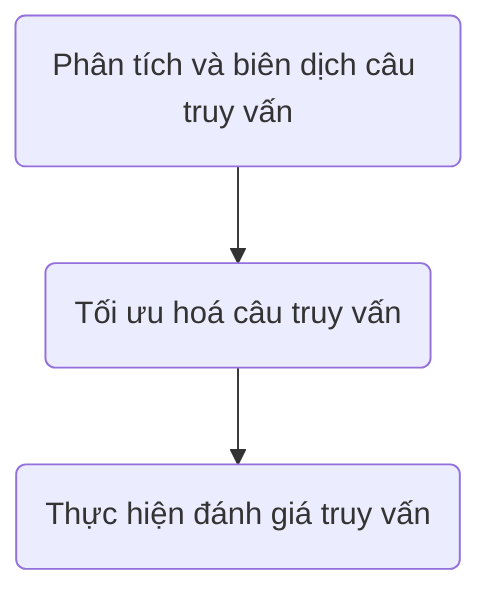

### 👉 Xử lý truy vấn :


* **Phân tích và biên dịch câu truy vấn**:
  * Dịch câu truy vấn từ ngôn ngữ bậc cao -> ngôn ngữ biểu diễn dữ liệu bên trong để máy tính thao tác
  Ex: ngôn ngữ đại số quan hệ

* **Tối ưu hoá câu truy vấn**:
  > Chọn ra kế hoạch thực hiện câu truy vấn có chi phí thấp nhất
  1. ***Tối ưu hoá đại số***: biến biểu thức đại số quan hệ đầu vào thành bt đsqh có thể xử lý hiệu quả và ít tốn kém hơn
  2. Đặc tả các thuật toán đặc biệt tiến hành thực thi các phép toán, chọn chỉ dẫn cụ thể để sử dụng
  3. Các dữ liệu thống kê cần thiết trong quá trình xem xét và lựa chọn: *số bộ trong quan hệ, kích thước của một bộ, số khối chứa các bộ của quan hệ, số bộ của quan hệ mà một khối có thể chứa, các thông tin về cơ chế truy cập, chỉ dẫn trên quan hệ...*
  
  * ***Chi phí cho việc thực hiện 1 truy vấn*** đo bởi chi phí sử dụng tài nguyên (truy cập đĩa, thời gian CPU dùng để thực hiện truy cập)

* **Thực hiện đánh giá truy vấn**
  * từ kế hoạch có được do trình tối ưu hoá, hệ thống sẽ tiến hành thực hiện các thao tác trên dữ liệu trong CSDL và đưa ra câu trả lời cho truy vấn đó.

## I. Đánh giá biểu thức Đại số quan hệ
Có hai hướng tiếp cận:

### 1.1 Vật chất hoá (Materialize)

* Lần lượt đánh giá các phép toán theo thứ tự thích hợp.
* Kết quả sẽ được *lưu trong một quan hệ trung gian tạm thời*, làm đầu cho các phép toán tiếp theo.

<mark style='background: pink'>**Nhược điểm**</mark>: cần phải xây dựng các quan hệ trung gian (gây thêm tốn kém chi phí)

### 1.2 Đường ống (Pipeline)

* Kết hợp một vài phép toán quan hệ vào một đường ống của các phép toán (kết quả của phép toán được chuyển trực tiếp cho phép toán tiếp theo, ko cần lưu lại)

**-> Giảm bớt số quan hệ trung gian tạm thời được tạo**
<mark style = 'background: chartreuse'>**-> Cải thiện hiệu quả đánh giá truy vấn**</mark>

*Ví dụ:* 
Gồm: kết nối và chiếu
- Tiếp cận vật chất hoá: kết quả phép nối tự nhiên được lưu lại trong quan hệ trung gian. Kết quả sau đó được đọc để tiến hành chiếu lấy kết quả mong muốn.
- Tiếp cận đường ống: kết quả phép nối được chuyển trực tiếp đến phép chiếu để xử lý và kết quả được ghi vào quan hệ đầu ra ( quan hệ kết quả được tạo lập trực tiếp)

## II. Tối ưu hoá các biểu thức Đại số quan hệ
> Tổ chức lại **trình tự thực hiện** các phép toán trong biểu thức để giảm chi phí thực hiện đánh giá biểu thức đó.

- Biểu thức đại số quan hệ được biểu diễn dưới dạng 1 cây toán tử, các nút lá là các quan hệ có trong biểu thức, các nút trong là phép toán.

### 2.1 Các chiến lược tối ưu (tổng quát)

1. Đẩy **Phép chọn** và **Phép chiếu** xuống thực hiện sớm nhất

2. Nhóm các dãy **Phép chọn** và **Phép chiếu** (nếu như có một dãy các phép chọn hoặc phép chiếu trên cùng 1 quan hệ)

3. Kết hợp **Phép chọn** và **Tích Descarte** thành **Phép kết nối**

4. Tìm các *biểu thức con chung* trong biểu thức đsqh để đánh giá 1 lần

5. Xác định các phép toán 8có thể được đưa vào đường ống* và thực hiện đánh giá chúng theo đường ống

6. Xử lý các tệp dữ liệu trước khi tiến hành tính toán
    - tạo lập chỉ dẫn, sắp xếp tệp dữ liệu

7. Ước lượng chi phí và lựa chọn thứ tự thực hiện
    - *Số phép tính, tài nguyên sử dụng, dung tích bộ nhớ, thời gian thực hiện*

### 2.2 Các phép biến đổi tương đương biểu thức đại số quan hệ
> Biểu thức &E_1& và &E_2& tương đương nếu cho cùng 1 kết quả trên 1 tập quan hệ

- &E_1, E_2, E_3 ...& là các biểu thức ĐSQH
- &F_1, F_2, F_3...& là các điều kiện chọn (kết nối)
- &X_1, X_2, ... Y, Z, U_1, U_2,...& là các tập thuộc tính

1. **Quy tắc kết hợp của phép tích Descarte và kết nối**
```Latex
(E_1 \times E_2) \times E_3 \equiv E_1 \times (E_2 \times E_3)\\
(E_1 * E_2) * E_3 \equiv E_1 * (E_2 \times E_3)\\
(E_1 \Join _ {F_1} E_2) \Join _{F_2} E_3 \equiv E_1 \Join _{F_1} (E_2 \Join _{F_2} E_3)
```
- Tích Descarte, Phép kết nối tự nhiên, Phép kết nối theo điều kiện
- Dùng cho **chiến lược 7**, lựa chọn để ko xuất hiện quan hệ trung gian quá lớn, xét dựa trên kích thước các quan hệ tham gia phép toán và mối liên hệ của quan hệ.

2. **Quy tắc giao hoán trong phép tích Descarte và kết nối**
```latex
E_1 \times E_2 \equiv E_2 \times E_1\\
E_1 * E_2 \equiv E_2 * E_1\\
E_1 \Join _F E_2 \equiv E_2 \Join _F E_1
```

3. **Quy tắc đối với dãy các phép chiếu**
```latex
\prod_{X_1}(\prod_{X_2}...\prod_{X_n}(E)...) \equiv \prod_{X_1}(E)\\
X_1 \subseteq X_2 \subseteq .... \subseteq X_n
```

4. **Quy tắc đối với dãy các phép chọn**
```latex
\sigma _{F_1}(\sigma _{F_2}... \sigma _{F_n}(E)...) \equiv \sigma _{{F_1}\land {F_2}...\land {F_n}}(E)
```

5. **Quy tắc giao hoán phép chọn và phép chiếu**
```latex
\prod_X (\sigma _F(E)) \equiv \sigma _F(\prod _X (E))
```
*Áp dụng khi F là điều kiện xác định được trên tập thuộc tính X*

Tổng quát:
```latex
\prod_X (\sigma _F(E)) \equiv \prod _X(\sigma _F(\prod _{XY} (E)))
```

6. **Quy tắc đối với phép chọn và phép tích Descarte**
- &E_1(U_1)& - biểu thức E1 xác định trên tập thuộc tính U1
- &F_1(U_1)& - điều kiện chọn F1 xác định trên tập thuộc tính U1

- $\sigma _F(E_1(U_1)\times E_2(U_2))$ tương đương: 
  * &\sigma _{F_1}(E_1)\timesE_2& với F = F_1(U_1)&
  * &\sigma _{F_1}(E_1) \times \sigma_{F_2}(E_2)& với &F=F_1(U_1)F2(U_2)&
  * &\sigma _{F_2}(\sigma_{F_1}(E_1) \times E_2)& với &F = F_1(U_1)F_2(U_1U_2)&

7. **Quy tắc phép chọn và phép hợp**
```latex
\sigma _F (E_1 \cup E_2) \equiv \sigma _F (E_1) \cup \sigma _F (E_2)
```

8. **Quy tắc đối với phép chọn và phép trừ**
```latex
\sigma _F (E_1 - E_2) \equiv \sigma _F(E_1) - \sigma _F(E_2)
```

9. **Quy tắc đối với phép chiếu và tích Descarte**
```latex
\prod _x (E_1 \cup E_2) \equiv \prod _X (E_1) \cup \prod _X (E_2)
```

10. **Quy tắc đối với phép chiếu và phép hợp**
```latex
\prod _X (E_1 \cup E_2) \equiv _X (E_1) \cup \prod _X (E_2)
```


