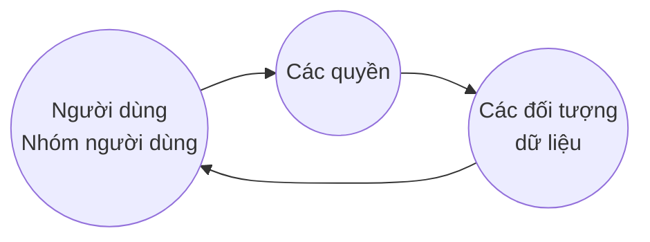

Yêu cầu khi thiết kế, cài đặt và quản trị CSDL:
  - **Đảm bảo tính an toàn của dữ liệu**
    - Tránh truy cập không hợp hệ từ phía người dùng 

  - **Đảm bảo tính đúng đắn của dữ liệu**
    - Tránh sai sót khi cập nhật dữ liệu
    - Tránh sai sót khi thao tác với dữ liệu

## I. An toàn dữ liệu
> là sự bảo vệ dữ liệu trong csdl chống lại những truy nhập, sửa đổi hay phá huỷ bất hợp pháp

* ***Người sử dụng hợp pháp***: người được cấp phép, uỷ quyền.

* Cần có cơ chế để quản lý người dùng.

* Các nhóm người dùng khác nhau trong hệ csdl *có những quyền sử dụng khác nhau* đối với các đối tượng dữ liệu.


### 1.1 Các quyền truy nhập

⛏️ **Người khai thác CSDL**:
* ***Quyền đọc dữ liệu*** - đọc một phần hay toàn bộ dữ liệu
* ***Quyền cập nhật dữ liệu*** - sửa đổi một số giá trị (nhưng ko được xoá dữ liệu)
* ***Quyền xoá dữ liệu*** - có thể xoá dữ liệu
* ***Quyền bổ sung dữ liệu*** - có thể thêm dữ liệu (nhưng không được thay đổi hoặc xoá dữ liệu có sẵn)

🕶️ **Người quản trị CSDL**:
* ***Quyền tạo chỉ dẫn*** - tạo chỉ dẫn trên các quan hệ
* ***Quyền thay đổi sơ đồ cơ sở dữ liệu*** - thêm hay xoá các thuộc tính của các quan hệ
* ***Quyền loại bỏ quan hệ*** - loại bỏ quan hệ 
* ***Quyền quản lí tài nguyên*** - có thể thêm vào csdl các quan hệ mới

😶 **Người dùng**:
- Cá nhân 
- Nhóm (Group)

📄 <mark style ='background: yellow'> Một số hệ quản trị có các **role** tương tự (i.e PostGreSQL) </mark>

### 1.2 Các đối tượng dữ liệu

* **Tables**

* **Views**

### 1.3 Trách nhiệm của người quản trị hệ thống

▶️ **Phân quyền người sử dụng**
- Xác định các quyền cụ thể của mỗi user hay group 
- Xác định *vai trò* và *trách nhiệm* của mỗi người sử dụng

▶️ **Xác minh người sử dụng**
- Cung cấp phương tiện cho người sử dụng để hệ thống có thể nhận biết người sử dụng đó
- Có các kĩ thuật sau:
  1. ***Kỹ thuật dùng tài khoản*** với tên, mật khẩu được bảo vệ bởi hệ thống
  2. ***Kỹ thuật sử dụng các hàm kiểm tra user*** đưa ra phép tính của hàm F, so sánh kết quả người dùng và kết quả hệ thống
  3. ***Kỹ thuật dùng thẻ*** với các loại thẻ điện tử, thẻ thông mih
  4. ***Kỹ thuật nhận dạng*** với các đặc điểm sinh học: giọng nói, vân tay ...

🔒 **Kiểm tra quyền truy cập của người sử dụng**
- Mỗi user có một bộ hồ sơ do admin thiết lập và được hệ thống quản lý

- Hồ sơ có chi tiết về các thao tác người sử dụng được phép thực hiện:
  - **Phân quyền người sử dụng**: System admin xác định khung nhìn để kiểm soát xem mỗi người sử dụng chỉ được truy nhập phần dữ liệu nào trong CSDL (có quyền đọc, thêm, xoá, sửa đổi) 
  
  - **Xác định và kiểm soát sự lưu chuyển dữ liệu**: hệ thống bảo trì danh sách các quyền chặt chẽ, vì user có thể được *quyền lan truyền các quyền* cho user khác.

### 1.4 Các câu lệnh

**CÂU LỆNH TẠO VIEW**
```sql
CREATE VIEW <viewname> [columns list] as <...>
```

**CÂU LỆNH PHÂN QUYỀN**
```sql
GRANT <các thao tác> ON <đối tượng> TO <user list> [WITH GRANT OPTION]
```

- Các thao tác: ***insert***, ***update***, ***delete***, ***select***, ***create***, ***alter***, ***drop***, ***read/write***
- Đối tượng: người hoặc nhóm, hoặc `public` (chia sẻ cho mọi user)
- [WITH GRANT OPTION]: cho phép người dùng được phân quyền có thể chia sẻ quyền của mình cho người khác

**CÂU LỆNH THU HỒI QUYỀN**
```sql
REVOKE <các thao tác> ON <đối tượng> FROM <user list> [RESTRICT/CASCADE]
```

- `RESTRICT`: các quyền chỉ thu hồi với những người được phân quyền trực tiếp, ko tính những user được chia sẻ qua *quyền lan truyền*
- `CASCADE`: thu hồi đối với user được cấp quyền cũng như các user được chia sẻ quyền này từ các user kia.

## II. Toàn vẹn dữ liệu
> là sự bảo vệ dữ liệu trong csdl chống lại sự sửa đổi, phá huỷ vô căn cứ, đảm bảo tính đúng đắn, chính xác của dữ liệu.

* Các thao tác có thể làm ảnh hưởng tới tính đúng đắn: **insert**, **delete**, **alter**

* Cần chỉ ra, duy trì các **ràng buộc toàn vẹn liên kết** với mỗi quan hệ.
  + Các ràng buộc đảm bảo các thao tác bởi legal user không làm mất đi tính đúng đắn của csdl.

* Ngoài ra, hệ thống còn cần <mark style='color: red; background: white'>**điều khiển tương tranh**</mark> -> Tránh các xung đột giữa các thao tác được đưa ra bởi các users khác nhau trong cùng 1 thời điểm.

### 2.1 Các ràng buộc toàn vẹn trong SQL
* Các ràng buộc về **khoá chính**, **khoá ngoài**, **kiểm tra miền giá trị** (use Check)

* **Assertion** (khẳng định)
  > Biểu thị một điều kiện mà CSDL luôn thoả mãn

  ```sql
  CREATE ASSERTION <CONSTRAINT NAME> CHECK (<SEARCH CONDITION>) 
  [<CONSTRAINT ATTRIBUTES>]
  ```
Example: 
```sql
CREATE ASSERTION KĐSốlượng CHECK
(NOT EXISTS (SELECT * FROM S 
WHERE numofemps < 50 
AND sid IN (SELECT sid FROM SP WHERE quantity >= 100)))
```

* **Trigger** 

## III. Điều khiển tương tranh
> Giải pháp cần thiết để chống đụng độ giữa các transaction (giao dịch) bởi các người dùng khác nhau mà có thể làm mất đi tính đúng đắn trong quá trình cập nhật.

*Các kiến thức về transaction có trong chương 9*


