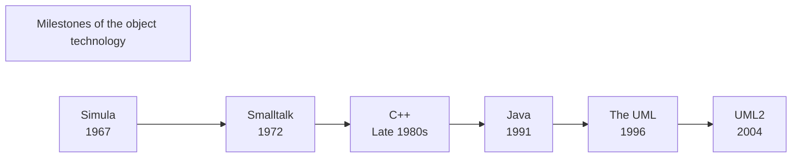
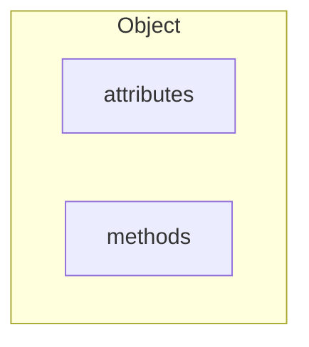

## Object - Oriented Technology
> ***Object Programming languages:*** Characterize elements in form of an objects
> ***Object - Oriented***: technique to model a system by objects

* Other programming paradigms: Aspect - Oriented Programming and Functional Programming

### Object Technology
> A set of rules (**abstraction**, **inheritance**, **encapsulation**, **polymophism**), instructions to build a software, together with languages, databases and other tools to support these rules.

* ***Abstraction*** : lets us selectively focus on the high-level and abstract way of the low-level details.
* ***Inheritance*** : is about code reuse, not hierarchies.
* ***Encapsulation*** : keeps state private so that we can better enforce business rules, protect model invariants, and develop a single source of truth for related data and logic.
* ***Polymorphism*** : provides the ability for us to design for dynamic runtime behavior, easy extensibility, and substitutability.

=> <mark>More testable, flexible and maintainable code</mark>

### Where is the Object technology used?
* Client/Server Systems and Web development
* Mobile development
* Embedded system
* Real-time systems

👉 ***The power of the Object Technology***:
1. Allow re-using source code and architectures
2. Reflecting more closely the real world
3. More stable, a system change is done in a small part of the system
4. More adaptable with changes

## Object and Class
### Object
> ***Object*** - an entity encapsulated in form of **state** and **behavior**.
> - **State**: attributes + relationships
> - **Behavior**: operations + methods

#### State of an object
> A possible conditions that the object exists.

* It can change over time.

#### Behavior of an object
> Determine how an object acts and reacts to requests from other objects.

* It is represented by the operations that the object can perform.

#### Unique identity of an object
* Each object has its **own unique identity**, even they may **share the same attributes and relationships**

> ***Instance attributes*** - attributes are defined by a specific value
> ***Instance*** - specific object

![[Pasted image 20221106161124.png]]

### Class
> Blueprint (bản thiết kế) or prototype for all the objects of a same type

*Ex*: class Car, class Bike

* A class defines **common attributes** and **methods** for all the objects of some type.

* Each object can have different attribute's representation 

![[Pasted image 20221106162339.png]]

### Interactions between objects
* Objects communicate to each other by message passing

> ***Message passing*** - a program (built via OOP) is a set of objects exchanging messages between them.

![[Pasted image 20221106162640.png]]

### Struture-Oriented >< Object-Oriented
|SO|OO|
|---|---|
|Program = Data Structures + Algorithms| Program = Objects + Messages|

### Procedural-Oriented >< Object-Oriented
|Procedural-Oriented|Object-Oriented|
|---|---|
|Main components are **procedures, functions**|Main components are **objects**|
|Data is **independent with procedures**|Data is **associated to function(method)** in a object. Each DS has methods executing on it.|
