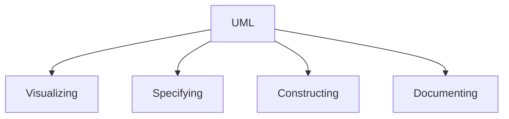

## UML Overview
### Modeling
> ***Model*** - a simplificatin of reality object

* Modeling help:
	* **Visualize** the system built
	* Specify the **structure** or **behavior** of a system
	* Give a **template** to instruct in constructing a system
	* Document the **decisions** made.

* Building a model of a complex systems helps to have a better understanding of those systems.
-> <b> Modeling is the key to successful projects</b>

### UML
> Unified modeling language

#### Visualizing
* To avoid error when communicating conceptual models to others.
-> *An explicit(rõ ràng) model facilitates(tạo đk) communciation*

#### Specifying
* UML builds models that are precise, unambiguous and complete.

#### Constructing
* UML models can be directly connected to a variety of programming languages.

#### Documenting
* The UML addresses documentation of system architecture, requirements, tests, project planning, and release management.

## Requirement modeling with use-case
### Purpose of Requirement
1. Establish and maintain agreement with stakeholders on what the software should do
2. Give software devs a better understanding of the requirements of the software.
3. Delimit the software.
4. Provide a basis for planning the technical contents of the iterations (sự lặp lại).
5. Provide a bsis for estimating cost and time to develop the software.
6. Define a user interface of the software.

### Software Behavior
> How a software acts and reacts. (actions and activities)

* It is captured in use case.
	* Use cases describe the interactions between the software and (parts of) its enviroment.

### Benefits of a Use-Case Model

![[Pasted image 20221106215454.png]]

### Major Concepts in Use-Case Modeling
* An actor represents **anything that interacts** with the software.

* A use-case describes a **sequence of events** performed by the software.
	* Those events yeild an visible result of value to a particular actor.

## Use-case diagrams
### Actors
* Actors represent roles a user of the software can play. (human, machine, other softwares, database....)

* They can **actively interchange information** with the software.
	* Can be a giver of information
	* Can be a passive recipient of information

* They are  <b>not part of the software (External)</b>

#### How to extract Actors
* Notice the noun in the problem desc -> extract a subject of action as a Actor

* Ensure that there are no any excesses and deficiencies between the problem desc and Actor extracted

* An actor name should: 
	* Clearly convey the actor's role
	* Describe their responsibilities

### Use Cases
* A use case models is a **dialouge** between one or more actors and the software

* A  use case describes the **actions the software takes** to deliver smth of value to the Actor.

#### How to extract Use Cases
* Notice the verb in the problem desc, and then extract a series of Actions as a UC.

* Ensure that there are no any excesses and deficiencies between the problem desc and the UC extracted.

* Check the consistency between UC and related Actors.

* Conduct a survey to learn whether customers, business representatives, analysts, and developers all understand the names and descriptions of the use cases

### Use-case diagram.
* A diagram modeling the dynamic aspects of softwares that describes a **software's functional requirements in terms of use cases**.

* A model of the software's intended functions (use cases) and its environment (actors).

![[Pasted image 20221106230432.png]]

#### Association between actor and use case
* Establish the actors that interact with related use cases.
![[Pasted image 20221106230545.png]]

#### Communicates-Association
* Channel of communication between an actor and a use case.

* A line is used to represent a communicates-association.
	* **With arrowhead** : indicate who initiates each interaction
	* **No arrowhead** : indicate either end can initiates each interaction
	
![[Pasted image 20221106231133.png]]

Ex: Use-case diagram of a bank system
![[Use_case_bank.png]]a

* **include** is 
* ***extend*** is

![[Pasted image 20221108003330.png]]
![[Pasted image 20221108003318.png]]
![[Pasted image 20221108003444.png]]

**More about use case diagram:** https://www.visual-paradigm.com/guide/uml-unified-modeling-language/what-is-use-case-diagram/
