## Mô hình thiết kế phân tầng
### Nguyên tắc "chia để trị"
* Xác định các nhiệm vụ cần thực hiện

* Tổ chức, điều phối thứ tự thực hiện các nhiệm vụ

* Phân định ai làm nhiệm vụ gì

* Đối với các bộ phận đồng cấp: phương tiện và cách thức trao đổi thông tin giống nhau.

### Trao đổi thông tin giữa các nút mạng
=> Phân chia nhiệm vụ cho các thành phần, tổ chức các thành phần thành các tầng (layer)

### Phân tầng
* Mỗi tầng
	* Có thể có **có một hoặc nhiều** chức năng
	
	* Triển khai dịch vụ để thực hiện các chức năng:
		* **Cung cấp** dịch vụ cho **tầng trên**
		* **Sử dụng** dịch vụ **tầng dưới**
		* **Độc lập** với các tầng còn lại
	
	* Mỗi dịch vụ có thể có một hoặc nhiều cách triển khai khác nhau, cho phép tầng trên lựa chọn dịch vụ phù hợp

***Lợi ích 🟢***
* Dễ dàng thiết kế, triển khai
* Dễ dàng tái sử dụng
* Dễ dàng nâng cấp

### Điểm truy cập dịch vụ - Service Access Point (SAP)
> Khái niệm trừu tượng, tại đó tầng trên sử dụng dịch vụ tầng dưới cung cấp

* Tầng trên chỉ quan tâm tới **cách sử dụng** dịch vụ tầng dưới chứ không quan tâm **cách thực hiện**.

* Cung cấp API
	* Tên hàm, các thức truyền số ko đổi
	* Nội dung hàm có thể thay đổi.

## Truyền thông trong kiến trúc phân tầng
***Các nguyên lý chung***:
* Tầng trên sử dụng dịch vụ tầng dưới
* Các tầng ngang hàng sử dụng chung "ngôn ngữ" và phương tiện trao đổi dữ liệu

### Dữ liệu được xử lý tại mỗi tầng ntn?
* Chia thành các **đơn vị dữ liệu giao thức** - Protocol Data Unit (PDU) = **Header** (địa chỉ, thông tin cho hthống mạng) + **Payload** (dữ liệu cần truyền tải)

* Chức năng mỗi tầng khác nhau -> cách thức xử lý khác nhau -> cần phối hợp chức năng giữa các tầng trong quá trình truyền tải.

![[Pasted image 20221102103301.png]]
📤***Bên gửi*** : thêm tiêu đề chứa thông tin phục vụ cho việc xử lý dữ liệu tại tầng tương ứng và chuyển cho tầng dưới (***Đóng gói dữ liệu - Encapsulation***)
📥***Bên nhận*** : xử lý dữ liệu theo **thông tin trong phần tiêu đề**, tách tiêu đề và chuyển dữ liệu cho tầng trên.

![[Pasted image 20221102103737.png]]

***NHẬN XÉT***:
- PDU tại các tầng đồng cấp của hai bên giống nhau ->truyền thông giữa các tầng ngang hàng (truyền thông logic)
- Phía nhận phải hiểu nội dung PDU của phía gửi 
- Phía nhận xử lý PDU nhận được với các tham số là thông tin trong tiêu đề mà phía gửi đã thiết lập.
- Phía nhận trả lời/không trả lời cho phía gửi
- Các PDU phải truyền đúng theo thứ tự 
=> ***Cần có bộ quy tắc cho hai bên.***

> ***Giao thức (Network Protocol)*** - tập hợp các quy tắc quy định **khuôn dạng, ngữ nghĩa, thứ tự** của các **thông điệp gửi/nhận** giữa các nút mạng và các **hành vi** khi trao đổi các thông điệp đó.

### Chồng giao thức (Protocol stack)
* Các chức năng được phân chia cho các tầng
	* Mỗi tầng có nhiều cách thức để thực hiện các chức năng 
	-> sinh ra các giao thức khác nhau.

> Ngăn xếp các giao thức truyền thông trên kiến trúc phân tầng.

* Giao thức của mỗi tầng:
	* Gọi dịch vụ nào của tầng dưới
	* Cung cấp dịch vụ cho giao thức tầng trên ntn

![[Pasted image 20221102110713.png]]
* Các tầng đồng cấp ở mỗi bên sử dụng **chung giao thức** để điều khiển quá trình truyền thông logic giữa chúng.
	* Hai cách thức để điều khiển là [[Chap1.4 - Kiến trúc phân tầng#Truyền thông hướng liên kết >< hướng không liên kết]]

### Truyền thông hướng liên kết >< hướng không liên kết
* Truyền thông hướng liên kết (connection oriented):
	* Dữ liệu được truyền qua 1 liên kết đã được thiết lập
	* Tin cậy

```mermaid
graph LR
	ob1[Thiết lập LK] -.-> ob2[Truyền dữ liệu] -.-> ob3[Huỷ LK]
```

* Truyền thông hướng không liên kết (connectionless)
	* Không thiết lập LK, chỉ có giai đoạn truyền dữ liệu
	* Không tin cậy
	* **"Best effort"** : truyền ngay với khả năng tối đa

### Giao thức Unicast, Multicast, Broadcast
> ***Unicast*** : giao thức đkhien truyền dữ liệu tới 1 đích
> ***Multicast*** : giao thức điều khiển truyền dữ liệu tới nhiều đích
> ***Broadcast*** : giao thức điều khiển truyền dữ liệu tới mọi đích

## Mô hình OSI và TCP/IP
### Mô hình OSI/ISO
1. ***Tầng ứng dụng (Application)***: cung cấp các ứng dụng trên mạng 
2. ***Tầng trình diễn (Presentation)*** : biểu diễn dữ liệu của ứng dụng (mã hoá, nén, chuyển đổi)
3. ***Tầng phiên (Session)***: quản lý phiên làm việc, đồng bộ hoá phiên, khôi phục quá trình trao đổi dữ liệu
4. ***Tầng giao vận (Transport)*** : xử lý việc truyền - nhận dữ liệu cho các ứng dụng chạy trên các nút mạng đầu - cuối.
5. ***Tầng mạng (Network)*** : chọn đường (định tuyến), chuyển tiếp gói tin từ nguồn đến đích.
6. ***Tầng liên kết dữ liệu (Data link)*** : truyền dữ liệu trên các lk vật lý giữa các nút mạng kế tiếp nhau
7. ***Tầng vật lý (Physical)*** : Chuyển dữ liệu (bit) thành tín hiệu và truyền

* Mô hình OSI là mô hình **tham chiếu chức năng** (các mô hình khác phải tham chiếu từ OSI: cung cấp đủ các chức năng như OSI, đúng thứ tự các tầng)

* Tuy nhiên, mô hình lại chỉ có ý nghĩa về mặt cơ sở lý thuyết, **không sử dụng trên thực tế**.

### Mô hình TCP/IP
> Mô hình Internet, được sử dụng trên hầu hết các hệ thống mạng

![[chap1_4 - TCP_IP model.png]]

### Triển khai kiến trúc phân tầng
* ***Nút mạng đầu cuối (end-system)***: PC, server, smartphone...
* ***Nút mạng trung gian*** : các thiết bị mạng chuyển tiếp dữ liệu (Hub, Switch, Router)

![[Chương 1 - Tổng quan.pptx-pages-105-107.pdf]]

### Chồng giao thức TCP/IP

![[Pasted image 20221102203550.png]]

>***Dạng "đồng hồ cát"*** : sử dụng **duy nhất 1 giao thức liên mạng (IP - Internet Protocol)** tại tầng mạng.

*  Cho phép một hệ thống mạng mới sử dụng công nghệ truyền dẫn bất kỳ kết nối với hệ thống mạng hiện tại
* Tách rời phát triển ứng dụng ở tầng cao với công nghệ truyền dẫn các tầng thấp (IP-based apps)
* Hỗ trợ thay đổi song song các công nghệ ở trên và dưới IP

⚠️ *Tuy nhiên, khó để nâng cấp bản thân giao thức IP (IPv4 -> IPv6)*

### Cài đặt TCP/IP trên hệ thống mạng
![[Pasted image 20221102213020.png]]

### Đóng gói trên chồng giao thức TCP/IP
![[Chương 1 - Tổng quan.pptx-pages-111-121.pdf]]

## Định danh trong TCP/IP
> ***Định danh*** - giá trị cho phép xác định 1 người hay 1 đối tượng.

***Cây phân cấp*** : 
* Cho phép quản lý một cách logic và hiệu quả một không gian địa chỉ khổng lồ
* Có tính mở rộng
![[Pasted image 20221102213723.png]]

### Định danh trên kiến trúc phân tầng
* Bằng việc gán cho các đối tượng (dịch vụ, máy trạm, thiết bị mạng) một giá trị riêng:
	* Phân biệt các đối tượng trong hệ thống
	* Xác định điểm xuất phát và đích đến của dữ liệu

* Mỗi tầng có một nhiệm vụ khác nhau để **điều khiển việc truyền thông tin giữa những đối tượng khác nhau** -> có các quy chế định danh khác nhau
	* Một đối tượng có thể mang nhiều định danh -> cần cơ chế **phân giải** để  tìm kiếm định danh của đối tượng ở tầng này khi đã biết định danh ở tầng khác.

![[Pasted image 20221102214807.png]]
> ***Domain name*** - định danh sử dụng trên tầng ứng dụng 

 - Chuỗi kí tự gọi nhớ
 - Người dùng sử dụng khi truy cập dịch vụ trên tầng ứng dụng
- Ko có ý nghĩa khi truyền dữ liệu giữa các nút mạng
- Có sự phân cấp

> ***Port number*** - định danh sử dụng trên tầng giao vận

* 16 bit
* Một chỉ số phụ, dùng kèm theo địa chỉ IP
* Các ứng dụng được định danh bởi **1 địa chỉ IP** và **một số hiệu cổng**

> ***IP Address*** - định danh dùng trên tầng mạng

* Giá trị phụ thuộc từng mạng, mỗi card mạng được gán 1 địa chỉ IP
* Định danh 1 máy tính trên 1 mạng IP
VD: 133.113.215.10 (ipv4); 2001:200:0:8803::53 (ipv6)

> ***Physical Address/MAC address*** - sử dụng trên tầng liên kết dữ liệu
* Có kích thước 48 bit
* Cố định trên card mạng NIC
* Sử dụng để định danh máy tính trong mạng cục bộ (Phân biệt các nút khác nhau trong cùng mạng)

![[Pasted image 20221102225255.png]]

## Tổng kết về phân tầng & chồng giao thức
### Khả năng cộng tác
* Rất nhiều công nghệ được triển khai theo nhiều cách khác nhau  trên các nút mạng
* Luôn thay đổi nhưng vẫn có thể trao đổi vì dùng chung giao thức

### Trừu tượng và tái sử dụng
* Mỗi tầng có nhiều lựa chọn giao thức để sử dụng
* Nhưng ở góc nhìn của tầng ứng dụng:
	* Các giao thức cung cấp API chuẩn để phát triển ứng dụng
	* Các tầng thấp "trong suốt" với tầng ứng dụng

### Trong suốt
* Công nghệ trên mỗi tầng thực hiện các phương thức truyền thông khác nhau
* Thay thế công nghệ ở các tầng có thể thực hiện song song (miễn là giữ nguyên SAP), thay thế ở một tầng ko ảnh hưởng tới các tầng khác.

### Hạn chế
* Một số thông tin ở tầng dưới bị “ẩn” (do tính trong suốt) đối với tầng trên có thế làm giảm hiệu năng hoạt động của tầng trên (và do đó làm giảm hiệu năng hoạt động của mạng)
Ví dụ: TCP phải kiểm soát tắc nghẽn trên đường truyền

* Phần tiêu đề có kích thước đáng kể trong gói tin

* Một số công nghệ tầng dưới có thể làm giao thức tầng trên thực hiện khó khăn hơn:
Ví dụ: TCP trên mạng không dây

* <mark>TCP/IP không có các cơ chế an toàn bảo mật thông tin </mark>