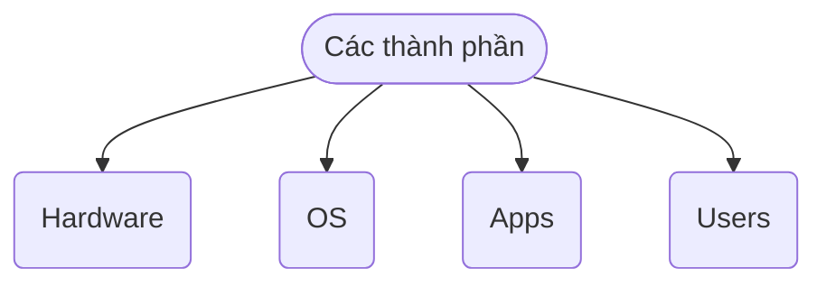
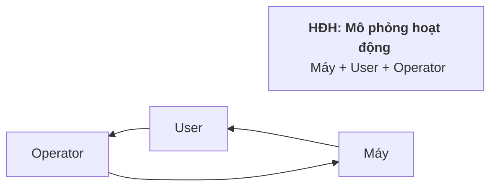
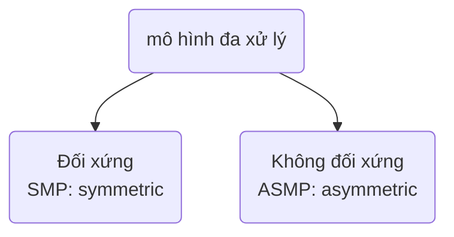
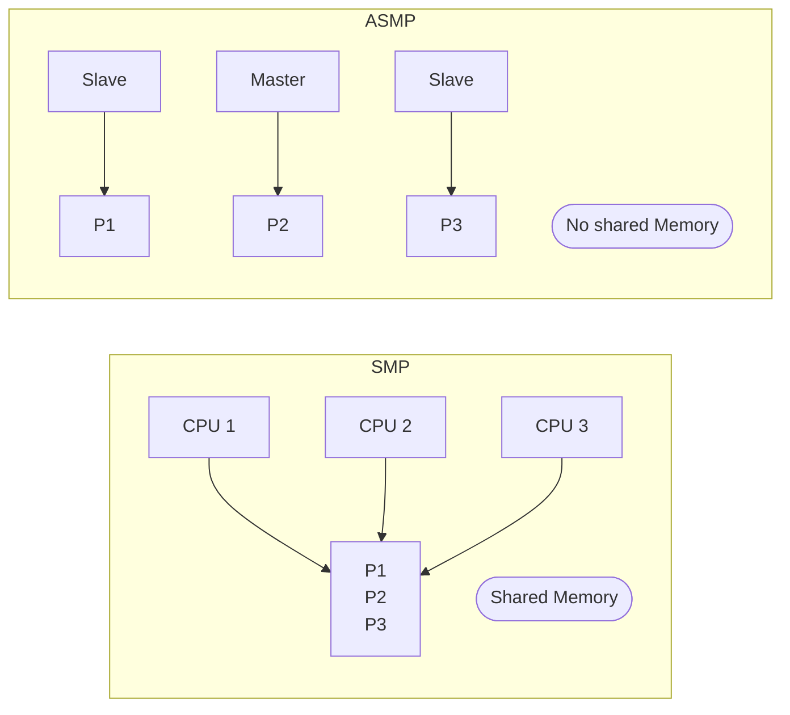
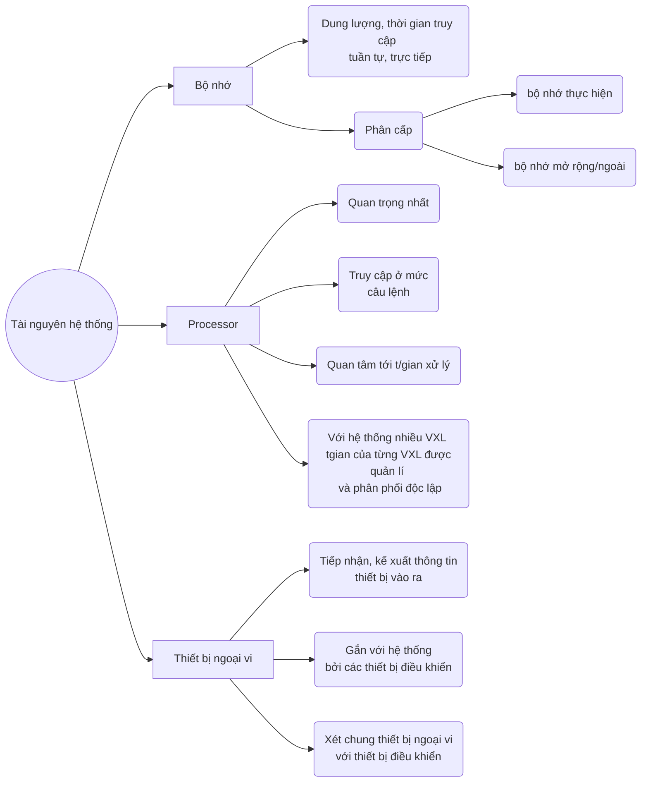
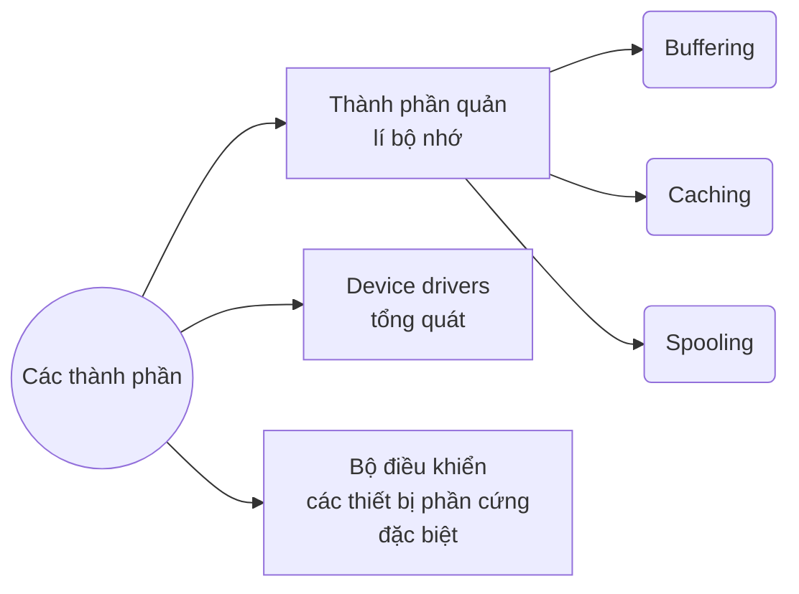
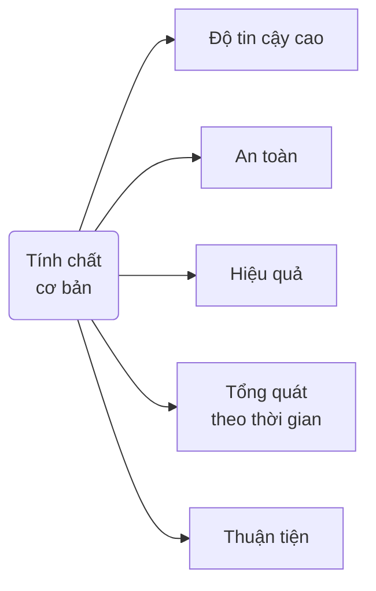

## I. Khái niệm
### Cấu trúc phân lớp của hệ thống tính toán
![[chap1_1.png]]
* Một/ nhiều CPU, các thiết bị điều khiển được **liên kết bằng 1 hệ thống bus chung** để truy cập tới bộ nhớ chia sẻ.
* Các thiết bị điều khiển và CPU thực hiện đồng thời, cạnh tranh với nhau.



**Hệ điều hành**:
* Vị trí: 
```
Apps
---{VM Interface}
OS
---{Physical Machine Interface}
Hardware
```

- Mục tiêu: cung cấp môi trường:
	* Thực hiện các chương trình
	
	* Khiến cho máy tính huận tiện, dễ sử dụng, hiệu quả hơn với người dùng
	
	* Chuẩn hoá giao diện người dùng
	
	* Khai thác tối đa phần cứng

### Chức năng HĐH:
* ***Giả lập một  máy tính ảo***:
	* Ẩn giấu các chi tiết phải thực hiện
	
	* Khai thác phần cứng máy tính hiệu quả, dễ dàng hơn
	
	* Đơn giản hoá việc lập trình: 
		* Ko phải làm việc với dãy nhị phân
		* Chương trình nghĩ nó sở hữu toàn bộ tài nguyên
		* Giao tiếp dễ dàng với phần cứng thuần tuý
	
	* Mở rộng hệ thống -> hệ thống dường như có những đặc trưng mong muốn (bộ nhớ ảo, máy in ảo ...)
	
	* Các CT hoạt động lỗi không ảnh hưởng trực tiếp tới CT khác

**Máy ảo**: Hữu ích cho phát triển HĐH 
- Nếu HĐH thử nghiệm bị lỗi --> lỗi chỉ giới hạn trong máy ảo
- Trợ giúp kiểm tra các chương trình trên các HĐH khác

![[chap1_3.png]]

* ***Quản lý tài nguyên của hệ thống****:
	* Tài nguyên hệ thống bao gồm: vi xử lý, bộ nhớ, thiết bị vào ra, file... được CT sử dụng để thực hiện công việc xác định 
	
	* Các CT đòi hỏi tài nguyên về mặt: **Thời gian** và **Không gian**
	
	* Máy tính hoạt động hiệu quả nhất khi được quản lí: 
		* Phân phối các tài nguyên cho CT cần thiết
		* Giải quyết **tranh chấp**
		* Quyết định **thứ tự cấp phát** tài nguyên cho những yêu cầu

## II. Lịch sử phát triển
<mark>=> Sự ra đời và phát triển của HĐH gắn liền với sự phát triển của máy tính, sự phát triển của HĐH cũng kéo theo sự phát triển của máy tính </mark>

## III. Định nghĩa và phân loại HĐH
### Định nghĩa
> Các đối tượng khác nhau cho các góc nhìn khác nhau về HĐH

|Góc độ quan sát| Định nghĩa|
|:---:|:---:|
|Người sử dụng|Hệ điều hành là hệ thống chương trình phục vụ *khai thác* hệ thống tính toán một cách thuận lợi.|
|Người quản lý|Hệ điều hành là hệ thống chương trình phục vụ *quản lý* chặt chẽ và sử dụng *tối ưu các tài nguyên* của hệ thống tính toán.|
|Quan điểm kỹ thuật|Hệ điều hành là hệ thống chương trình trang bị cho một máy tính cụ thể để tạo ra một máy tính logic mới với tài nguyên mới và khả năng mới|
|Quan điểm hệ thống|Hệ điều hành là hệ thống mô hình hoá, mô phỏng hoạt động của máy tính, của người sử dụng và operator, hoạt động trong chế độ đối thoại nhằm tạo môi trường khai thác thuận lợi hệ thống máy tính và quản lý tối ưu tài nguyên của hệ thống.|



* Có 3 thành phần được mô phỏng -> cần có 3 loại ngôn ngữ
	* ***Máy***:
		* là ngôn ngữ thực hiện duy nhất, mọi ngôn ngữ phải dịch ra ngôn ngữ này
	* ***Vận hành của hệ thống***:
		* Câu lệnh của HĐH
		* Được dịch bởi Shell
	* ***Thuật toán***:
		* Ngôn ngữ lập trình
		* Được dịch bởi chương trình dịch

### Phân loại
#### Hệ thống xử lý theo lô đơn chương trình
> Thực hiện các CT **lần lượt** theo những chỉ thị đã được **xác định trước.**

* Khi 1 CT kết thúc, CT tiếp theo được tự động thực hiện, ko cần sự can thiệp từ bên ngoài.

* Phải tồn tại **bộ giám sát**:
	* Thực hiện dãy các job
	* Thường trú trong hệ thống

* Đòi hỏi có **tổ chức hàng đợi chương trình**

 ⚠️ <mark> Khi CT truy cập thiết bị vào/ra, processor rơi vào trạng thái chờ đợi. </mark>

#### Hệ thống xử lý theo lô đa chương trình
> Cho phép thực hiện nhiều CT đồng thời

1. Nạp **một phần mã và dữ liệu** của các CT/ tiến trình vào bộ nhớ (*phần còn lại sẽ được nạp tại thời điểm thích hợp*) -> Chương trình sẵn sàng được thực hiện
3. Thực hiện CT **như hệ thống đơn CT**
4. Nếu CT **thực hiện vào ra**, processor sẽ được dành cho CT đang sẵn sàng khác.

👍 ***ƯU ĐIỂM
* **Tiết kiệm** bộ nhớ (không cần nạp toàn bộ CT vào)
* Hạn chế **thời gian rỗi** của processor

❔***CÁC VẤN ĐỀ***
* **Chi phí cao** cho điều phối processor
* Giải quyết **vấn đề chia sẻ bộ nhớ** giữa các CT

#### Hệ thống phân chia thời gian
> Chia sẻ thời gian của processor cho các CT/tiến trình đang sẵn sàng thực hiện.

![[chap1_4.png]]

* Nguyên tắc giống như hệ thống xử lý theo lô đa CT (nạp một phần của các CT)

* Processor được **phân phối lại** phụ thuộc chủ yếu vào **sự điều phối của HĐH**

* Thời gian hoán đổi giữa các tiến trình **nhỏ**, các CT cảm giác song song

* Thường được gọi là ***HĐH đa nhiệm***

#### Hệ thống song song
> Hệ thống có nhiều vi xử lý (VXL):> 

* Công việc thực hiện nhanh chóng hơn 

* Độ tin cậy cao (một vxl hỏng ko ảnh hưởng tới toàn hệ thống)

* Ưu thế hơn hệ thống nhiều máy có 1 VXL vì cùng chia sẻ bộ nhớ, thiết bị ngoại vi


|***Symmetric Multiprocessing***|***Asymmetric Multiprocessing***|
|:---|:---|
|Mỗi bộ xử lý chạy 1 tiến trình/tiểu trình|Mỗi **bộ xử lý chính** kiểm soát toàn bộ hệ thống|
|Các **VXL giao tiếp với nhau** thông qua 1 **bộ nhớ dùng chung**|Các bộ xử lý khác thực hiện theo lệnh của bộ xử lý chính hoặc theo những chỉ thị đã được định nghĩa trước|
|Cơ chế chịu lỗi và khả năng cân bằng tải tối ưu.<br>⚠️ <mark>Đồng bộ giữa các VXL</mark>|Mô hình theo dạng **quan hệ chủ tớ**: bộ xử lý chính sẽ lập lịch cho các bộ xử lý khác|



#### Hệ thống phân tán
* Mỗi bộ xử lý có bộ nhớ cục bộ riêng, và trao đổi với nhau thông qua các đường truyền thông

* Các VXL thường khác nhau về kích thước và chức năng (Máy cá nhân, máy trạm, máy mini, ...)

* Được sử dụng để:
	* Chia xẻ tài nguyên
	* Tăng tốc độ tính toán
	* An toàn

#### Hệ thống xử lý thời gian thực
* Sử dụng chủ yếu trong lĩnh vực điều khiển

* Hệ thống phải cho kết quả chính xấc trong khoảng thời gian xác định

* Đòi hỏi sự phối hợp cao giữa phần mềm và phần cứng.

## IV. Các khái niệm trong HĐH
### Tiến trình và luồng
> **Tiến trình**: 1 chương trình đang thực hiện

* Bao gồm:
	* Mã lệnh
	* Dữ liệu
	* Ngăn xếp, con trỏ ngăn xếp, các thanh ghi

* Tiến trình $\neq$ Chương trình:
	* ***Tiến trình***: trạng thái động của chương trình
	* ***Chương trình***: thực thể thụ động, chứa đựng các chỉ thị điều khiển máy tính thực hiện 1 nhiệm vụ nào đó.

> ***Hệ thống đa tiến trình***:
* HĐH theo chu kì: 1 chu kì dừng để bắt đầu 1 chu kì khác
	* Cần có ***Bảng tiến trình*** (*process table*) để lưu thông tin các TT

* 1 TT có thể khởi tạo TT khác
* Các TT có thể trao đổi thông tin với nhau
* 1 TT có thể bao gồm nhiều luồng (tiểu trình)

> ***Luồng***: chuỗi lệnh được thực hiện trong tiến trình
> - Mã thực thi, dữ liệu
> - Con trỏ lệnh, ngăn xếp, tập thanh ghi riêng 

* TT  chỉ chứa **1 luồng** (Heavyweight process)
* TT gồm **nhiều luồng** (Lightweight process)

* Mô hình đa luồng (Multi_threading):
	* Các luồng hoạt động song song, chia sẻ biến toàn cục của tiến trình. 

![[chap2_thread.png]]

### Tài nguyên hệ thống
> Tất cả những gì cần thiết để cho 1 tiến trình có thể thực hiện được.
> ***Không gian***: không gian lưu trữ của hệ thống
> ***Thời gian***: thời gian thực hiện lệnh/truy xuất dữ liệu 



* Kiểu tài nguyên:
	* Vật lý
	* Logic

* Khả năng sử dụng chung:
	* **Dùng chung được**
	* **Không dùng chung** nhưng **phân chia được**
	* **Không dùng chung được** và **không phân chia được**

**Tài nguyên ảo**
> Loại tài nguyên cung cấp cho CT người sử dụng dưới dạng **đã được biến đổi**.

* Chỉ xuất hiện khi hệ thống cần tới, hoặc khi được tạo ra
* Tự động mất đi khi tiến trình gắn với nó kết thúc.

### Bộ xử lý lệnh (Shell)
* TT đặc biệt: nơi **giao tiếp giữa user và OS**

* **Nhiệm vụ**:
	* Nhận lệnh người dùng (thông qua cơ chế dòng lệnh)
	* Phân tích lệnh
	* Phát sinh TT mới thực hiện yêu cầu của lệnh.

* Đối với môi trường đơn nhiệm, Shell sẽ chờ cho TT kết thúc trước khi nhận lệnh mới. Trong khi đó với môi trường đa nhiệm, Shell sau khi khởi tạo TT, có thể nhận lệnh mới luôn.

### Lời gọi hệ thống (System calls)
> Môi trường giao tiếp giữa **CT người dùng** và **OS**
> - CT sử dụng System calls để **yêu cầu các dịch vụ** từ OS (tạo, xoá, sử dụng các đối tượng phần mềm được vận hành bởi OS)
> - Mỗi System calls **ứng với 1 thư viện các CT con**.

* System calls được thực hiện dưới dạng:
	* Các câu lệnh (ngôn ngữ lập trình cấp thấp)
	* Lệnh gọi ngắt (hợp ngữ)
	* Thủ tục gọi hàm API (windows)

* Tham số cho các dịch vụ và kết quả trả về được đặt tại **vùng nhớ đặc biệt**

* Nhiệm vụ:
	* Quản lý TT: khởi tạo, huỷ
	* Quản lý bộ nhớ: cấp phát và giải phóng
	* Quản lý file: tạo mới, xoá, đọc và ghi
	* Quản lý thiết bị vào ra: thực hiện trao đổi vào/ra
	* Trao đổi thông tin với hệ thống: lấy/đặt ngày giờ
	* Truyền thông liên tiến trình

![[Pasted image 20221030213911.png]]

## V. Cấu trúc hệ điều hành
### Các thành phần của hệ thống
#### Quản lý tiến trình
* TT sử dụng tài nguyên của hệ thống để hoàn thành công việc
	* Tài nguyên được **cấp từ khi khởi tạo** TT
	* Tài nguyên được **trả về khi TT kết thúc**

* Hệ thống tồn tại nhiều TT cùng 1 thời điểm: 
	* TT hệ thống
	* TT người sử dụng

👉***Nhiệm vụ của HĐH***:
1. **Tạo và huỷ** các TT của người dùng hoặc của hệ thống
2. **Ngưng và thực hiện lại** một TT
3. Cung cấp cơ chế **đồng bộ** TT
4. Cung cấp cách **thông tin** giữa các TT
5. Cung cấp cơ chế **cơ chế kiểm soát bế tắc** giữa các TT


#### Quản lý bộ nhớ chính
> ***Bộ nhớ chính*** là 1 mảng kiểu byte (word)
> - Mỗi phần tử có **địa chỉ**
> - Nơi lưu dữ liệu được CPU truy xuất

* CT muốn thi hành phải được ánh xạ thành **địa chỉ tuyệt đối** và **nạp vào bộ nhớ chính**.
* CT thi hành, hệ thống **truy xuất các chỉ thị và dữ liệu trong bộ nhớ chính**.
	* Một số TT được lưu trong bộ nhớ để tối ưu hoá quá trình hoạt động của CPU và tốc độ của máy tính.

👉***Nhiệm vụ của HĐH***:
1. Lưu trữ thông tin về các **vị trí trong bộ nhớ đã được sử dụng**, cũng như **ai sử dụng**
2. **Quyết định TT** nào được nạp vào bộ nhớ chính khi bộ nhớ đã có thể dùng được
3. **Cấp phát và thu hồi bộ nhớ** khi cần.

#### Quản lý hệ thống vào ra
* Che dấu những đặc thù của các thiết bị phần cứng đối với user -> **Người dùng dễ thap tác hơn**



#### Quản lý file
* Máy tính có thể lưu trữ thông tin trên nhiều loại thiết bị lưu trữ khác nhau
	* ***File*** - đơn vị lưu trữ cơ bản nhất

👉***Nhiệm vụ của HĐH***:
 1. Tạo/ xoá một file/folder
 2. Hỗ trợ các thao tác trên file và folder
 3. Ánh xạ file trên hệ thống lưu trữ phụ.
 4. Backup hệ thống file trên các thiết bị lưu trữ.

#### Quản lý bộ nhớ lưu trữ
* CT được lưu trữ trên bộ nhớ phụ cho tới khi được nào vào bộ nhớ chính và thực hiện sử dụng đĩa để chứa dữ liệu kết quả xử lý.
	* Đĩa có thể chứa dữ liệu và kết quả xử lý tạm thời -> ***bộ nhớ ảo***

👉***Nhiệm vụ của HĐH***:
1. **Quản lý vùng trống** trên đĩa
2. **Cung cấp** vùng lưu trữ theo yêu cầu
3. **Lập lịch** cho truy nhập đĩa hiệu quả.

#### Hệ thống trao đổi dữ liệu (Hệ thống phân tán)
> Gồm tập các VXL (có thể không đồng nhất) ko có đồng hồ và bộ nhớ chung.
> Mỗi VXL có bộ nhớ cục bộ riêng.

* Các VXL lk qua hệ thống mạng truyền thông

* Truyền thông được thực hiện nhờ các giao thức như FTP, HTTP

* Hệ phân tán cho phép người dùng truy cập các tài nguyên khác nhau

* Truy cập tới tài nguyên dùng chung giúp:
	* Tăng tốc độ tính toán
	* Tăng khả năng sẵn sàng của dữ liệu
	* Tăng độ tin cậy của hệ thống

#### Hệ thống bảo vệ
> Cơ chế kiểm soát truy cập của chương trình, TT hay người dùng tới hệ thống hoặc các tài nguyên của người dùng

* Cơ chế bảo vệ đòi hỏi:
	* Phân biệt giữa sử dụng hợp pháp và không hợp pháp
	* Xác lập các kiểm soát được áp đặt
	* Cung cấp phương tiện ép buộc.

#### Giao diện người dùng

![[Pasted image 20221030233417.png]]

* Thực hiện câu lệnh người dùng
* Một số hình thái giao tiếp người máy:
	* Dòng lệnh
	* Bảng chọn
	* Biểu tượng

### Dịch vụ Hệ điều hành
#### Dịnh vụ chính yếu
* **Thi hành chương trình** :
	* Nạp CT vào bộ nhớ chính và thi hành
	* Chấm dứt thi hành theo cách **thông thường** hoặc **bất thường** (lỗi)

* **Thao tác nhập xuất** : để tăng tính hiệu quả, CT không truy xuất trực tiếp các thiết bị vào/ra
	* OS phải **cung cấp phương tiện** để thực hiện vào ra.

* **Thao tác trên hệ thống tập tin** : CT có thể đọc, viết, tạo, xoá file.

* **Truyền thông** : **trao đổi thông tin** giữa các TT đang thực thi trên cùng 1 máy hoặc trên các máy trong mạng.
	* Nhờ **chia sẻ bộ nhớ** hoặc kỹ thuật **chuyển thông điệp**

* **Phát hiện lỗi** : chỉ ra lỗi tại CPU, bộ nhớ, trong thiết bị vào ra hay trong các CT
	* Mỗi dạng lỗi, OS sẽ có cách giải quyết tương ứng.

#### Dịch vụ phụ trợ
*Nhằm vận hành hệ thống*
* **Cung cấp tài nguyên** : cung cấp tài nguyên cho nhiều users hoặc nhiều CT thực hiện trong cùng 1 thời điểm.

* **Thống kê báo cáo** : lưu trữ thông tin về loại và số lượng tài nguyên sử dụng -> sử dụng cho **tính toán** và **nghiên cứu** 

* **Bảo vệ** : đảm bảo mọi truy cập tới các tài nguyên hệ thống đều được kiểm soát.

### Lời gọi hệ thống
[[Chap1 - Tổng quan#Lời gọi hệ thống (System calls)]]

### Các cấu trúc hệ thống

![[Hệ-Điều-Hành-Chuong-1-113-118.pdf]]

## VI. Tính chất cơ bản


### Độ tin cậy cao
* Mọi hđ, tbao của OS phải chuẩn xác 
	* Cung cấp tt chỉ khi chắn chắn đúng
		* Thông báo, ngừng xử lý hoặc trao quyền quyết định cho người dùng khi gặp lỗi
	* Cần có hỗ trợ từ thiết bị

### An toàn
* Dữ liệu và CT được bảo vệ
	* Ko bị thay đổi ngoài ý muốn và trong mọi chế độ làm việc
	* Hạn chế truy cập bất hợp pháp

* Các tài nguyên khác nhau có yêu cầu bảo vệ khác nhau

* Bảo vệ nhiều mức với nhiều công cụ khác nhau

<mark> Đặc biệt quan trọng với HĐH đa nhiệm</mark>

### Hiệu quả
* Các tài nguyên phải được sử dụng triệt để
	* Dù tài nguyên hạn chế nhưng vẫn xử lý được những yêu cầu phức tạp

* Hệ thống cần phải duy trì được sự đồng bộ
	* Cac thiết bị tốc độ chậm không ảnh huổng tới hoạt động của hệ thống.

### Tổng quát theo thời gian
* Hệ thống có tính kế thừa
	* Các thao tác, thông báo ko thay đổi (nếu có thì phải có tbao và hướng dẫn cụ thể)
	* Đảm bảo tính kế thừa duy trì và phát triển user

* Hệ thống cần phải có khả năng thích nghi với những thay đổi có thể xảy ra.

### Thuận tiện
* Dễ sử dụng
* Nhiều mức với hiệu quả khác nhau
* Có hệ thống trợ giúp phong phú.

## VII. Vấn đề xây dựng HĐH
* Nguyên tắc modul
* Nguyên tắc tương đối trong định vị
* Nguyên tắc macroprocessor
* Nguyên tắc khởi tạo trong cài đặt
* Nguyên tắc lặp chức năng
* Nguyên tắc giá trị chuẩn
* Nguyên tắc bảo vệ nhiều mức