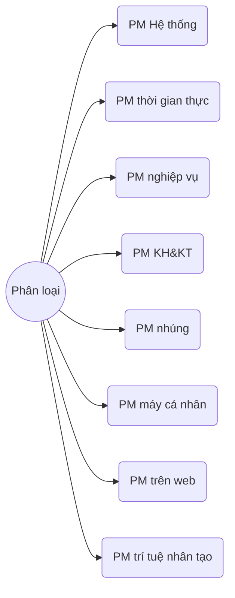
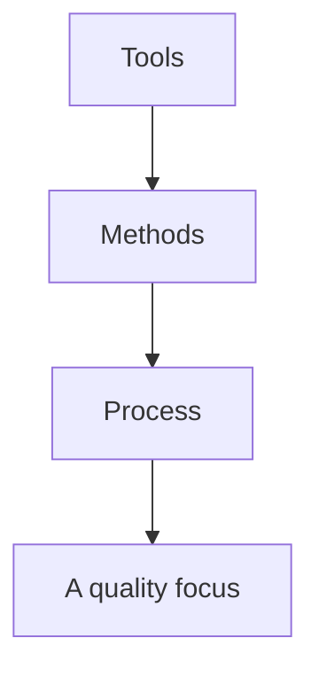

## I. Phần mềm là gì?
>Bao gồm:
>- **Các lệnh** khi thực hiện thì cung cấp những chức năng và kết quả mong muốn.
>- **Các cấu trúc dữ liệu** làm cho chương trình thao tác thông tin thích hợp.
>- **Các tài liệu mô tả** thao tác và cách sử dụng chương trình.

### Các đặc trưng của phần mềm
* Là hàng hoá **vô hình**

* Chất lượng không bị mòn đi mà **còn được cải thiện tốt lên** sau các lần sửa lỗi.

*  **Chứa lỗi tiềm tàng**, khả năng chứa lỗi tỉ lệ thuận với quy mô phần mềm

* Lỗi dễ được **phát hiện bởi người ngoài**

* Chức năng được biến đổi theo thời gian (hoặc theo nơi sử dụng).

## II. Phân loại phần mềm

## III. Công nghệ phần mềm là gì?
> Lĩnh vực khoa học về các **phương pháp luận**, **kỹ thuật** và **công cụ** tích hợp trong quy trình sản xuất và vận hành phần mềm, nhằm tạo ra phần mềm với **chất lượng mong muốn**.

### CNPM là công nghệ phân lớp

***Quy trình - Process***
* **Gắn kết các lớp** với nhau
* **Nền tảng** cho kỹ thuật phần mềm
* **Đảm bảo thời gian** phát triển
* **Tạo cơ sở** cho việc kiểm soát, quản lý dự án phần mềm
* Thiết lập bối cảnh mà các phương pháp kỹ thuật được sử dụng
* Tạo sản phẩm
* Thiết lập các cột mốc
* Đảm bảo chất lượng
* Quản lý thay đổi

***Các phương pháp - Methods***
* Cung cấp **kỹ thuật** cho xây dựng phần mềm
* Các tác vụ:
	* Giao tiếp
	* Phân tích yêu cầu
	* Mô hình thiết kế
	* Xây dựng chương trình
	* Kiểm thử
	* Hỗ trợ

* Dựa trên các nguyên tắc cơ bản:
	* Để chi phối từng lĩnh vực công nghệ
	* Bao gồm các hoạt động mô hình hoá

***Công cụ - Tools***
* Tự động hoặc bán tự động **hỗ trợ cho quy trình** và **các phương pháp**
* Hướng đến chất lượng (A quality focus )
	* Nền tảng
	* Bất kỳ cách tiếp cận kỹ thuật nào đều phải dựa trên cam kết về chất lượng
	* Thúc đẩy liên tục việc cải tiến quy trình

### Các pha phát triển phần mềm

***Definition phase***
* Xác định "What": Các **yêu cầu chính** của hệ thống và phần mềm được xác định
	* Thông tin nào sẽ được xử lý
	* Chức năng và hiệu quả mong muốn
	* Hành vi mong đợi của hệ thống
	* Các giao diện cần thiết lập
	* Những rằng buộc về thiết kế
	* Những tiêu chí cần thẩm định.

***Development phase***
* Xác định "How":
	* Cách thức dữ liệu được cấu trúc
	* Chức năng được triển khai trong kiến trúc phần mềm
	* Các chi tiết thủ tục được cài đặt
	* Cách xác định các đặc điểm của giao diện
	* Cách chuyển từ thiết kế sang lập trình
	* Cách thức kiểm thử.

***Support phase***
* Liên kết với các thay đổi "Change":
	* Sửa chữa - Correction
	* Thích ứng - Adaptation
	* Nâng cao - Enhancement
	* Phòng ngừa - Prevention

## IV. Các vấn đề trong công nghệ phần mềm
* Không có phương pháp mô tả rõ ràng yêu cầu từ khách hàng
	-> Dễ phát sinh trục trặc sau khi bàn giao sp

* Khó đáp ứng nhu cầu thay đổi của người dùng với những pm quy mô lớn, có tư liệu đặc tả cố định.

* Phương pháp luận thiết kế không nhất quán
	-> Không đồng nhất trong thiết kế, gây giảm chất lượng phần mềm.

* Không có quy chuẩn về việc tạo tư liệu trong quy trình sx pm
	-> Đặc tả ko rõ ràng, làm giảm chất lượng pm

* Không kiểm thử tính đúng đắn của phần mềm theo từng giai đoạn, đợi đến cuối mới phát sinh lỗi 
	-> gây chậm trễ, bàn giao sản phẩm không đúng hạn

* Coi trọng lập trình hơn thiết kế 
	-> giảm chất lượng phần mềm

* Coi thường việc tái sử dụng pm 
	-> giảm năng suất lao động

* Không chứng minh được tính đúng đắn của phần mềm 
	-> giảm độ tin cậy của phần mềm

* Chuẩn về một phần mềm tốt ko thể đo được một cách định lượng
	-> Không thể đánh giá tính đúng đắn của phần mềm

* Đầu tư nhân lực quá nhiều vào việc bảo trì
	-> giảm hiệu suất lđ của nhân viên

* Bảo trì kéo dài
	-> gỉam chất lượng của tư liệu và ảnh hưởng tới những việc khác

* Quản lý dự án lỏng lẻo
	-> lịch trình sx pm ko rõ ràng

* Không có tiêu chuẩn để ước lượng nhân lực và dự toán
	-> Kéo dài thời hạn, gây đội kinh phí của dự án.