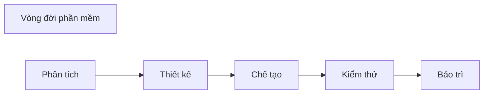

## 1️⃣ Hệ thống/phần mềm
Ví dụ với Hệ thống kinh doanh:
* Phần cứng, hệ thống mạng, tài liệu
* Phần mềm:
	* Phần mềm nền tảng (OS)
	* Phần mềm trung gian (Middle software)
	* Ứng dụng doanh nghiệp (Business Application Software)

## 2️⃣ Vòng đời hệ thống/phần mềm
> Thời kì tính từ lúc phần mềm được hình thành đáp ứng yêu cầu, vận hành, bảo dưỡng, cho đến khi bị loại bỏ, không còn được sử dụng.

* Mọi sản phẩm pm đều có vòng đời, có thể khá dài 

* Nhưng vòng đời có thể được rút ngắn do tiến bộ công nghệ

### Các pha trong vòng đời PM
* Tất cả các sp pm đều trải qua ít nhất các giai đoạn sau:
	* ***Phân tích*** - xác định nhu cầu khách hàng, các ràng buộc sản phẩm
	* ***Thiết kế*** - xác định cấu trúc/tổ chức của hệ thống phần mềm
	* ***Chế tạo*** - viết phần mềm
	* ***Kiểm thử*** - vận hành hệ thống với mục đích kiểm tra khiếm khuyết
	* ***Bảo trì*** - sửa chữa, cập nhật sản phẩm sau khi được khách hàng triển khai

### Các mô hình vòng đời phần mềm
* ***Quá trình*** - tập hợp các hoạt động, với đầu vào và đầu ra được xác định rõ ràng, để hoàn thành một số nhiệm vụ.

> ***Mô hình vòng đời*** - là một mô tả về quá trình thực hiện một sp phần mềm trong 1 phần hoặc toàn bộ vòng đời của sp đó.

* Các mô hình vòng đời có xu hướng **tập trung vào các pha chính** và mối quan hệ của chúng với các pha khác.

* Mô hình vòng đời là **mô tả quy trình phần mềm**.

## 3️⃣ Quy trình phát triển phần mềm

![[Chap2_quytrinh_ptrien_pm.png]]

## 4️⃣ Các mô hình quy trình phần mềm

### Mô hình thác nước
* Mô hình vòng đời lâu nhất (từ 1970)

* Được gọi là thác nước vì được vẽ bằng **chuỗi các hoạt động qua các giai đoạn của vòng đời theo hướng "xuống dốc"** từ trái qua phải

* Có nhiều phiên bản:
	* Các giai đoạn/hoạt động có thể có mức độ chi tiết khác nhau
	* Phản hồi có thể linh hoạt hoặc ít hơn.

***Thác nước nghiêm ngặt*** (strict)
* Vòng đời lý tưởng
* Không có phản hồi

![[Pasted image 20221030171124.png]]

***Thác nước không nghiêm ngặt*** (no-strict)
* Thực tế hơn
* Có một lượng lớn sự lặp lại các pha trước đó.

![[Pasted image 20221030171251.png]]

#### 👍Điểm mạnh
* Hoàn thành một giai đoạn trước khi tiếp tục giai đoạn tiếp theo
* Nhấn mạnh việc lập kế hoạch sớm, đầu vào của khách hàng và thiết kế
* Nhấn mạnh kiểm tra 
* Cung cấp các chất lượng ở mỗi giai đoạn vòng đời.

#### 👎Điểm yếu
* Phụ thuộc các yêu cầu được xác định sớm từ ban đầu
* Phụ thuộc vào việc tách các yêu cầu khỏi thiết kế
* Không khả thi với trường hợp có nhiều thay đổi
* Nhấn mạnh vào sản phẩm hơn quy trình

### Mô hình mẫu thử 

![[Pasted image 20221030172032.png]]

**Dùng khi nào?**
* **Khi mới rõ mục đích chung chung** của pm, chưa rõ chi tiết đầu vào, quy trình xử lý hay yêu cầu đầu ra.

* **Thu thập yêu cầu** qua các thiết kế nhanh.

* Có bản mẫu để **thảo luận gợi yêu cầu của người dùng**.

**Các mô hình mang tính tăng dần** :
* Phần lớn các phần mềm phức tạp đều **tiến hoá theo tgian** do các yếu tố: môi trường thay đổi, phát sinh các yêu cầu thêm, hoàn thiện các tính năng đã có.
	* Các mô hình tiến hoá (evolutionary models) có **sự lặp lại**, các phiên bản được hoàn thiện hơn, phức tạp hơn.

### Mô hình gia tăng
* Kết hợp mô hình **tuần tự** và **lặp lại** của mô hình [[Chap2 - Vòng đời phần mềm#4️⃣ Các mô hình quy trình phần mềm#Mô hình mẫu thử]]
	* Sản phẩm với những **yêu cầu cơ bản nhất** của hệ thống được phát triển.
	* Các chức năng, yêu cầu khác được **phát triển thêm sau (gia tăng)**.
	* **Lặp lại quy trình** để hoàn thiện dần.

![[chap2_MoHinhGiaTang.png]]

### Mô hình xoắn ốc

* ***Giao tiếp khách hàng*** : giữa dev và customer để tìm hiểu yêu cầu, ý kiến

* ***Lập kế hoạch*** : xác lập tài nguyên, thời hạn và những thông tin khác

* ***Phân tích rủi ro*** : xem xét mạo hiểm kỹ thuật và mạo hiểm quản lý

* ***Kỹ nghệ*** : xây dựng một hay một số biểu diễn của ứng dụng

* ***Xây dựng và xuất xưởng*** : xây dựng, kiểm thử, cài đặt và cung cấp hỗ trợ người dùng (tư liệu, huấn luyện ...)

* ***Đánh giá của khách hàng*** : nhận các phản hồi của users về biểu diễn phần mềm trong giai đoạn kỹ nghệ và cài đặt

![[Chap2_spiral_model.png]]

#### Điểm mạnh
👍 Tốt cho các phần mềm **quy mô lớn**.

👍 Dễ **kiểm soát các mạo hiểm** ở từng mức tiến hoá

#### Điểm yếu
👎**Khó thuyết phục** khách hàng về khả năng kiểm soát của pp

👎**Chưa được phổ biến** như các mô hình "thác nước" hoặc "mẫu thử".

#### Mô hình xoắn ốc WINWIN

![[Pasted image 20221030205929.png]]

* Nhằm thoả hiệp của dev và customer:
	* Khách hàng có phần mềm thoả mãn yêu cầu chính
	* Nhà phát triển có kinh phí thoả đáng và tgian hợp lí

### Mô hình phát triển nhanh - RAD
>Quy trình phát triển phần mềm gia tăng, tăng dần từng bước với chu kì phát triển ngắn (60-90 ngày)

*Phân biệt với pp [[Chap3 - Phương pháp Agile#Phương pháp Agile:]]*
*RAD is primarily **focused on prototypes** while agile is mostly focused on **breaking down the project into features** which are then delivered in various sprints over the development cycle.*

* Xây dựng dựa trên **hướng thành phần** (Component-based construction) với khả năng **tái sử dụng** (reuse).

* Gồm 1 số nhóm, mỗi nhóm là 1 RAD theo các pha:

![[Chap2_RAD_model.png]]
