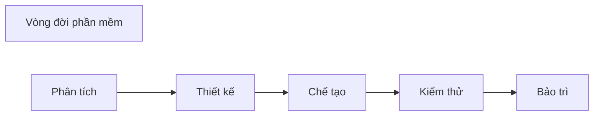

 ## 1️⃣ Hệ thống/phần mềm
Ví dụ với Hệ thống kinh doanh:
* Phần cứng, hệ thống mạng, tài liệu
* Phần mềm:
	* Phần mềm nền tảng (OS)
	* Phần mềm trung gian (Middle software)
	* Ứng dụng doanh nghiệp (Business Application Software)

## 2️⃣ Vòng đời hệ thống/phần mềm
> Thời kì tính từ lúc phần mềm được hình thành đáp ứng yêu cầu, vận hành, bảo dưỡng, cho đến khi bị loại bỏ, không còn được sử dụng.

* Mọi sản phẩm pm đều có vòng đời, có thể khá dài 

* Nhưng vòng đời có thể được rút ngắn do tiến bộ công nghệ

### Các pha trong vòng đời PM
* Tất cả các sp pm đều trải qua ít nhất các giai đoạn sau:
	* ***Phân tích*** - xác định nhu cầu khách hàng, các ràng buộc sản phẩm
	* ***Thiết kế*** - xác định cấu trúc/tổ chức của hệ thống phần mềm
	* ***Chế tạo*** - viết phần mềm
	* ***Kiểm thử*** - vận hành hệ thống với mục đích kiểm tra khiếm khuyết
	* ***Bảo trì*** - sửa chữa, cập nhật sản phẩm sau khi được khách hàng triển khai

### Các mô hình vòng đời phần mềm
* ***Quá trình*** - tập hợp các hoạt động, với đầu vào và đầu ra được xác định rõ ràng, để hoàn thành một số nhiệm vụ.

> ***Mô hình vòng đời*** - là một mô tả về quá trình thực hiện một sp phần mềm trong 1 phần hoặc toàn bộ vòng đời của sp đó.

* Các mô hình vòng đời có xu hướng **tập trung vào các pha chính** và mối quan hệ của chúng với các pha khác.

* Mô hình vòng đời là **mô tả quy trình phần mềm**.

## 3️⃣ Quy trình phát triển phần mềm

![[Chap2_quytrinh_ptrien_pm.png]]

## 4️⃣ Các mô hình quy trình phần mềm

### Mô hình thác nước
* Mô hình vòng đời lâu nhất (từ 1970)

* Được gọi là thác nước vì được vẽ bằng **chuỗi các hoạt động qua các giai đoạn của vòng đời theo hướng "xuống dốc"** từ trái qua phải

* Có nhiều phiên bản:
	* Các giai đoạn/hoạt động có thể có mức độ chi tiết khác nhau
	* Phản hồi có thể linh hoạt hoặc ít hơn.

***Thác nước nghiêm ngặt*** (strict)
* Vòng đời lý tưởng
* Không có phản hồi

![[Pasted image 20221030171124.png]]

***Thác nước không nghiêm ngặt*** (no-strict)
* Thực tế hơn
* Có một lượng lớn sự lặp lại các pha trước đó.

![[Pasted image 20221030171251.png]]

#### 👍Điểm mạnh
* Hoàn thành một giai đoạn trước khi tiếp tục giai đoạn tiếp theo
* Nhấn mạnh việc lập kế hoạch sớm, đầu vào của khách hàng và thiết kế
* Nhấn mạnh kiểm tra 
* Cung cấp các chất lượng ở mỗi giai đoạn vòng đời.

#### 👎Điểm yếu
* Phụ thuộc các yêu cầu được xác định sớm từ ban đầu
* Phụ thuộc vào việc tách các yêu cầu khỏi thiết kế
* Không khả thi với trường hợp có nhiều thay đổi
* Nhấn mạnh vào sản phẩm hơn quy trình

### Mô hình mẫu thử 

![[Pasted image 20221030172032.png]]

**Dùng khi nào?**
* **Khi mới rõ mục đích chung chung** của pm, chưa rõ chi tiết đầu vào, quy trình xử lý hay yêu cầu đầu ra.

* **Thu thập yêu cầu** qua các thiết kế nhanh.

* Có bản mẫu để **thảo luận gợi yêu cầu của người dùng**.

**Các mô hình mang tính tăng dần** :
* Phần lớn các phần mềm phức tạp đều **tiến hoá theo tgian** do các yếu tố: môi trường thay đổi, phát sinh các yêu cầu thêm, hoàn thiện các tính năng đã có.
	* Các mô hình tiến hoá (evolutionary models) có **sự lặp lại**, các phiên bản được hoàn thiện hơn, phức tạp hơn.

### Mô hình gia tăng
* Kết hợp mô hình **tuần tự** và **lặp lại** của mô hình [[Chap2 - Vòng đời phần mềm#4️⃣ Các mô hình quy trình phần mềm#Mô hình mẫu thử]]
	* Sản phẩm với những **yêu cầu cơ bản nhất** của hệ thống được phát triển.
	* Các chức năng, yêu cầu khác được **phát triển thêm sau (gia tăng)**.
	* **Lặp lại quy trình** để hoàn thiện dần.

![[chap2_MoHinhGiaTang.png]]

### Mô hình xoắn ốc

* ***Giao tiếp khách hàng*** : giữa dev và customer để tìm hiểu yêu cầu, ý kiến

* ***Lập kế hoạch*** : xác lập tài nguyên, thời hạn và những thông tin khác

* ***Phân tích rủi ro*** : xem xét mạo hiểm kỹ thuật và mạo hiểm quản lý

* ***Kỹ nghệ*** : xây dựng một hay một số biểu diễn của ứng dụng

* ***Xây dựng và xuất xưởng*** : xây dựng, kiểm thử, cài đặt và cung cấp hỗ trợ người dùng (tư liệu, huấn luyện ...)

* ***Đánh giá của khách hàng*** : nhận các phản hồi của users về biểu diễn phần mềm trong giai đoạn kỹ nghệ và cài đặt

![[Chap2_spiral_model.png]]

#### Điểm mạnh
👍 Tốt cho các phần mềm **quy mô lớn**.

👍 Dễ **kiểm soát các mạo hiểm** ở từng mức tiến hoá

#### Điểm yếu
👎**Khó thuyết phục** khách hàng về khả năng kiểm soát của pp

👎**Chưa được phổ biến** như các mô hình "thác nước" hoặc "mẫu thử".

#### Mô hình xoắn ốc WINWIN

![[Pasted image 20221030205929.png]]

* Nhằm thoả hiệp của dev và customer:
	* Khách hàng có phần mềm thoả mãn yêu cầu chính
	* Nhà phát triển có kinh phí thoả đáng và tgian hợp lí

### Mô hình phát triển nhanh - RAD
>Quy trình phát triển phần mềm gia tăng, tăng dần từng bước với chu kì phát triển ngắn (60-90 ngày)

*Phân biệt với pp [[Chap3 - Phương pháp Agile#Phương pháp Agile:]]*
> [!quote] *RAD is primarily **focused on prototypes** while agile is mostly focused on **breaking down the project into features** which are then delivered in various sprints over the development cycle.*

* Xây dựng dựa trên **hướng thành phần** (Component-based construction) với khả năng **tái sử dụng** (reuse).

* Gồm 1 số nhóm, mỗi nhóm là 1 RAD theo các pha:

![[Chap2_RAD_model.png]]

### Tổng quan các mô hình

| |Đặc điểm chính|Ưu điểm|Nhược điểm|Tình huống áp dụng|
|:---:|:---|:---|:---|:---|
|Mô hình Thác nước (Waterfall)|Gồm 6 giai đoạn chính cố định  + Require Analysis + System Design  + Coding + Testing + Implementing + Maintenance| + Đơn giản, dễ sử dụng + Dễ quãn lý do tiến hành tuần tự từng bước + Các bước rõ ràng, hoàn thành cùng thời điểm|- Độ linh hoạt không cao  (Khi có sai sót sẽ khiến toàn bộ quy trình phải dừng) - Khó có sản phẩm mẫu sớm  - Rủi ro cao và ít chắc chắn|Cho những dự án có độ phức tạp thấp, thời gian ngắn|
|Mô hình Chế thử (Prototype)|- Mô hình lặp lại 3 bước sau nhằm liên tục làm rõ, hoàn thiện sản phẩm:  + Nghe khách hàng trình bày + Tạo/sửa bản mẫu + Khách kiểm tra bản mẫu|+ Đơn giản, dễ áp dụng  + Độ linh động cao, có sai sót sẽ sửa được luôn + Tồn tại các phiên bản phần mềm -> Quản lý dễ dàng dự hoàn thiện của sản phẩm|- Mất thời gian vì phải trao đổi và sửa chữa liên tục - Không phải lúc nào cũng dễ dàng đạt được thoả thuận giữa hai bên|+ Khi chưa rõ chi tiết đầu vào/yêu cầu xử lý/yêu cầu đầu ra  + Cần định nghĩa các yêu cầu rõ ràng hơn|
|Mô hình Gia tăng (Incremental)|- Chu trình lớn sẽ chia nhỏ thành từng bản khác nhau, tương ứng với những chu kì nhỏ:  + Mỗi chu kỳ nhỏ (module) sẽ do nhóm nghiệp vụ đảm nhiệm + Phầm mềm sẽ được gia tăng. hoàn thiện dần theo từng bước|+ Sớm tạo ra nguyên mẫu + Độ linh hoạt cao vì đã chia nhỏ thành nhiều module + Giảm chi phí kiếm tra và ra sản phẩm + Rủi ro phát sinh dễ được kiểm soát hơn|- Cần nguồn nhân lực đồi dài và chi phí khá tốn kém vì mỗi nhóm đảm nhiệm một module riêng - Việc chia module một cách hợp lí là không dễ dàng - Khó modulize với các vấn đề phức tạp|+ Áp dụng với những dự án rõ ràng, đầy đủ (Các yêu cầu được định nghĩa rõ ràng) + Cần nguyên mẫu sớm + Nhân lực và chi phí luôn sẵn sầng để thực hiện dự án. + Tồn tại những module có tỉ lệ lỗi cao|
|Mô hình Xoắn ốc (Spiral)|Phụ thuộc vào sự thoả hiệp của người phát triển và khách hàng. Chú trọng vào quản lý rủi ro của dự án.  Gồm 6 giai đoạn được lặp lại để hoàn thiện sp: + Giao tiếp khách hàng + Lập kế hoạch + Phân tích rủi ro + Thực thi kỹ thuật + Xây dựng và sản xuất + Đánh giá của khách hàng|+ Rủi ro được kiểm soát tốt + Luôn nhận được phản hồi từ khách hàng (giúp làm hài lòng) + Kiểm soát tài liệu, phê duyệt chặt chẽ + Ước lượng chi phí trong từng giai đoạn đơn giản hơn|- Lãng phí nếu áp dụng vào dự án nhỏ - Có thể kéo dài vô hạn do tính xoắn ốc - Tồn tại nhiều giai đoạn trung gian trong quá trình hoàn thiện - Sự phức tạp trong khâu phân tích rủi ro|+ ứng dụng tốt trong các dự án lớn và quan trọng + Những dự án phần mềm tiềm ẩn nhiều rủi ro + Khách hàng có yêu cầu sản phẩm liên tục được kiểm định và phê duyệt|
|Mô hình Mô hình dựa thành phần|- Gắn với những công nghệ hướng đối tượng qua việc tạo các lớp có chứa cả dữ liệu và giải thuật xử lý dữ liệu Tương tự như mô hình xoắn ốc (6 giai đoạn): + Xác định thành phần ứng viên + Tìm thành phần từ thư viện + Lấy thành phần nếu có + Xây dựng thành phần nếu không có + Đặt thành phần vào thư viện + Xây dựng bước lặp thứ n của hệ thống|+ Rủi ro được kiểm soát tốt + Luôn nhận được phản hồi từ khách hàng giúp làm hài lòng khách hàng + Kiểm soát tài liệu, phê duyệt chặt chẽ + Ước lượng chi phí cho từng giai đoạn đơn giản hơn|- Lãng phí nếu áp dụng với dự án nhỏ - Có thể kéo dài vô tận (tương tự Spiral) - Tồn tại nhiều giai đoạn trung gian trong quá trình hoàn thiện - Phân tích rủi ro rất quan trọng và khó khăn trong việc phân tích đúng|+ ứng dụng tốt trong các dự án lớn và quan trọng + Những dự án phần mềm tiềm ẩn nhiều rủi ro + Những dự án chuẩn công nghiệp với thời gian yêu cầu ngắn|

