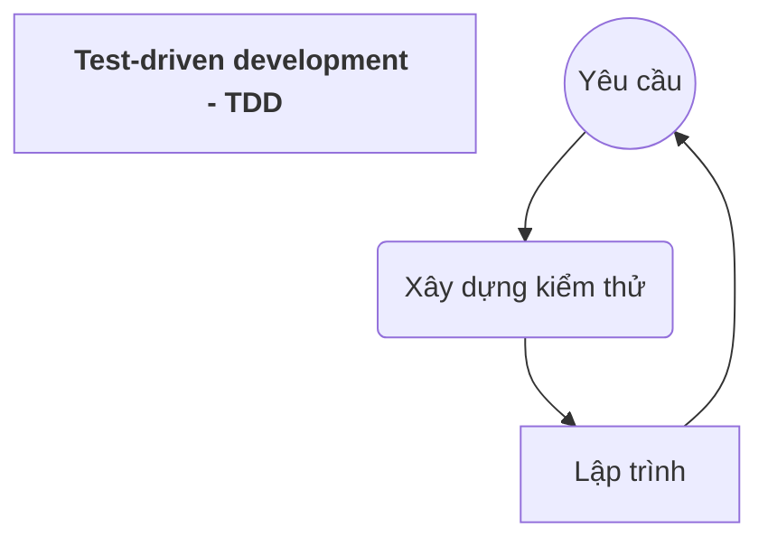
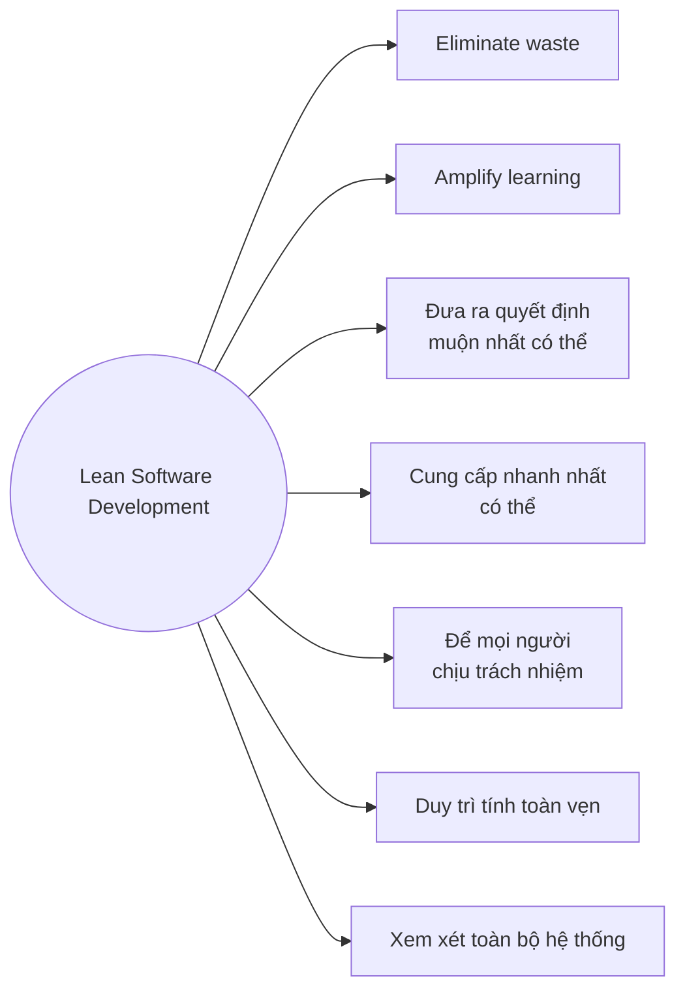

## I. Các khái niệm cơ bản

***Vấn đề thường gặp trong các mô hình quy trình phần mềm***
* Sự thay đổi của phần mềm
	* Yêu cầu
	* Công nghệ
	* Môi trường

* Rủi ro do thời gian phát triển kéo dài

* Chất lượng của sản phẩm phần mềm

* Giao tiếp với khách hàng

### Phương pháp Agile:
* Phản ứng hiệu quả (nhanh chóng và thích ứng) với sự thay đổi
* Kết hợp: **tạo mẫu** (prototypes) + **thử nghiệm** (testing)
* Lập trình **liên tục**
* Liên tục xác nhận yêu cầu của khách hàng

👉*Tạo ra sản phẩm phần mềm một cách nhanh chóng nhất có thể*

### Lịch sử phát triển của Agile
* Là một **triết lý** được đưa ra vào năm 2001
* Agile thay đổi đáng kể từ cách tiếp cận phát triển phần mềm nặng **theo hướng tài liệu** (như mô hình thác nước)
![[Chap3_1_agilehis.png]]

## II. Các nguyên lý cơ bản của phương pháp Agile
> [!abstract] Đặc điểm Agile
> >[!note] 4 tuyên ngôn:
> > * Các cá nhân và tương tác > các quy trình và công cụ
> > * Phần mềm làm việc  > tài liệu toàn diện
> > * Sự hợp tác của khách hàng  > đàm phán
> > * Đáp ứng sự thay đổi  > tuân theo kế hoạch
> -------
> > [!note] 12 nguyên lý
> > * Khách hàng: sự hài lòng thông qua việc phân phối sớm
> > * Thay đổi: hoan nghênh sự thay đổi
> > * Phát hành sản phẩm thường xuyên, tgian phát triển ngắn
> > * Hơp tác: làm việc cùng nhau,  khách hàng và nhóm phát triển, standing meeting
> > * Tin cậy: cốt cán là các cá nhân có động lực, cung cấp môi trường phù hợp, dành sự tin tưởng để hoàn thành cv
> > * Face to face
> > * Phần mềm hoạt động
> > * Phát triển bền vững
> > * Mới và tốt với công nghệ, giải pháp thiết kế, nguyên lí
> > * Sự đơn giản: tối đa hoá khối lượng công việc chưa hoàn thành
> > * Tự tổ chức: kiến trúc, yêu cầu và thiết kế tốt nhất từ các nhóm dự án
> > * Review và điều chỉnh: sao cho phù hợp

![[20221024_153211.jpg]]
## III. Ưu, nhược điểm của phương pháp Agile 
### 👍 Ưu điểm:
* Phù hợp **dự án nhỏ** hay có những yêu cầu thay đổi

* Khách hàng có thể **xem trước từng phần** trong quá trình phát triển dự án, **luôn sẵn sàng thay đổi** theo yêu cầu 

* Chia dự án thành các phần nhỏ cho các team, các team họp ngắn hàng ngày **thảo luận về tiến trình và giải quyết các vấn đề nảy sinh** -> **đảm bảo đúng quy trình** phát triển dự án.

* Tỉ lệ thành công cao hơn các quy trình khác. 

### 👎Nhược điểm:
* **Khó xác định** loại dự án phần mềm nào phù hợp nhất với pp Agile

* Nhiều tổ chức lớn gặp khó khăn khi chuyển từ pp truyền thống -> pp Agile

* Có rủi ro khi:
	* Quy mô lớn (>20 developers)
	* Phân tán (Các nhóm ko ở chung)
	* Khách hàng không đáng tin cậy
	* Bắt buộc quy trình nhanh trong nhóm phát triển
	* Dev thiếu kinh nghiệm

## IV. Extreme Programming
* **Không thể lập trình** cho đến khi biết yêu cầu

* **Cần khắc phục giai đoạn đầu tiên** khi hệ thống đi vào sản xuất càng nhanh càng tốt

* **Kết hợp phân tích tổng thể** dưới dạng các vấn đề, được định hướng kinh doanh, có thể kiểm tra và ước tính được

* 1 tháng - thời gian dài để đưa ra những vấn đề cho một dự án

### Xác định thời điểm lập trình
***Đối với khách hàng:***
* **chọn bản phát hành tiếp theo tính năng (vấn đề) giá trị nhất** trong các vấn đề (dựa trên chi phí và tốc độ cài đặt của nhóm)

* Khách hàng xác định **vấn đề của lần lặp tiếp theo** bằng cách chọn những vấn đề giá trị nhất còn lại trong bản phát hành, được thông báo lại bằng chi phí và tốc độ của nhóm.

***Đối với lập trình viên***
* Nhận trách nhiệm cho các nhiệm vụ chi tiết.

* Xác định các trường hợp kiểm thử, chứng minh nhiệm vụ hoàn thành

* Làm việc với đối tác để chạy các test case, đồng thời cải tiến -> duy trì thiết kế đơn giản nhất cho toàn hệ thống

### Bí quyết thành công
* Phát triển "cực đoan" với các hoạt động lập trình và kiểm thử

* Liên tục chuyển giao các phiên bản sản phẩm mới

* Phải thực hiện tất cả các test cho mỗi phiên bản và chỉ chấp nhận khi test thành công

### Ưu điểm của XP 🟢
* Cải thiện tính đồng đội (nếu hoàn thành tốt việc)

* Xây dựng năng lực ở tất cả các thành viên trong nhóm

* TDD giúp cho các developer hiểu về các viết code chất lượng, cải thiện quan niệm về thiết kế và giúp cải thiện về ước lượng.

* Cung cấp nhiều **công cụ cho quản lý** (Dự đoán, tính linh hoạt về nguồn lực, ...)

* Cung cấp cho khách hàng **khả năng xem xét công ty** có thể thực hiện công việc của mình hay không

* **Không lãng phí thời gian** cũng như tạo ra các tài liệu vô ích

### Nhược điểm của XP 🔴
* **Thiết kế trở nên tiềm ẩn** thay vì rõ ràng

* Dựa vào thiết kế là **rủi ro**

* **Khó viết kiểm thử tốt**

* **Lặp lại thường xuyên có thể gây giảm chất lượng**

* Để thực hiện tốt, cần phải được làm **thường xuyên**

## V. Scrum
> Thuật ngữ chỉ **nhóm người chơi với nhau**

* Nhiệm vụ: tăng tốc việc phát hành sản phẩm

### Quy trình
* Các công việc phát triển được chia thành các "gói"

* Mỗi vòng lặp phát triển "sprint"

* Đầu vào mỗi vòng lặp: "backlog":
	* Công việc hiện tại
	* Công việc còn tồn đọng của vòng lặp trước

* Thường xuyên có các cuộc họp ngắn

* Kết thúc sprint: rút kinh nghiệm + kiểm tra tiến độ

![[sprint_proc.png]]
👉 <mark><b>Các công việc tồn</b></mark> : được điền vào pha lập kế hoạch của lần phát hành sản phẩm, xác định phạm vi của bản phát hành.

### Các khái niệm
* ***Burndown Chart***: biểu đồ công việc còn tồn trong sprint (cập nhật mỗi ngày), sử dụng để theo dõi tiến trình, quyết định khi nào các mục phải được loại bỏ khỏi sprint backlog và hoãn lại sprint tiếp theo.

* ***Product backlog***: danh sách đầy đủ các yêu cầu (lỗi, yêu cầu năng cao, cải tiến khả năng sử dụng và hiệu suất) hiện **không có trong bản phát hành sản phẩm**

* ***ScrumMaster***: người chịu trách nhiệm quản lý dự án.

* ***Sprint backlog***: danh sách các công việc được chỉ định cho 1 sprint, nhưng chưa hoàn thành.
	* Thực tế, ko có cv nào của sprint cần quá 2 ngày để hoàn thành
	* Giúp nhóm dự đoán mức độ nỗ lực cần thiết để hoàn thành 1 sprint.

### Các pha của Scrums
![[scrum_phases.png]]

### Scrum Meetings
* Trong 1 sprint, nhóm có một **cuộc họp hàng ngày**
	* Các thành viên mô tả cv sẽ được thực hiện trong hôm nay, báo cáo tiến độ từ ngày hôm trc.
	* Thường là **stand meeting**

* Khi các backlog đã được thực hiện để người dùng tin vào rằng bản phát hành đáng được đưa vào sản xuất -> kết thúc quá trình phát triển -> nhóm thực hiện kiểm tra tích hợp, đào tạo và làm tài liệu khi cần thiết để phát hành sản phẩm. 

### Ưu, nhược điểm của Scrum

|Pros|Cons|
|:---|:---|
|Sử dụng sprint nhỏ để **chia hệ thống thành các phần nhỏ hơn** một cách hiệu quả và phân chia cho các nhóm|Chỉ hoạt động khi có **sự tin tưởng vào các nhóm dev**, nếu đội ngũ dev chưa chắc tay -> Rất rủi ro|
|Hoạt động chính: "cuộc họp hàng ngày", đưa ra bằng chứng về việc hoàn thành nhiệm vụ, cải tiến liên tục -> Cho phép **áp dụng kỹ thuật từ dưới lên một cách nhanh chóng**|Thiết kế lý tưởng cho các công ty có **các phương pháp nhanh hiện có** -> Công ty **cần có kiến thức về pp làm việc** trước khi triển khai|

## VI. Các phương pháp Agile khác (Lean Software Dev)

> Để khách hàng trì hoãn việc quyết định về những yêu cầu càng lâu càng tốt, khi đã có yêu cầu thì cần cung cấp hệ thống nhanh nhất có thể

### Tập trung vào kiểm thử
![[Chap3_2.png]]

### Ưu, nhược điểm
![[Chap3_3.png]]