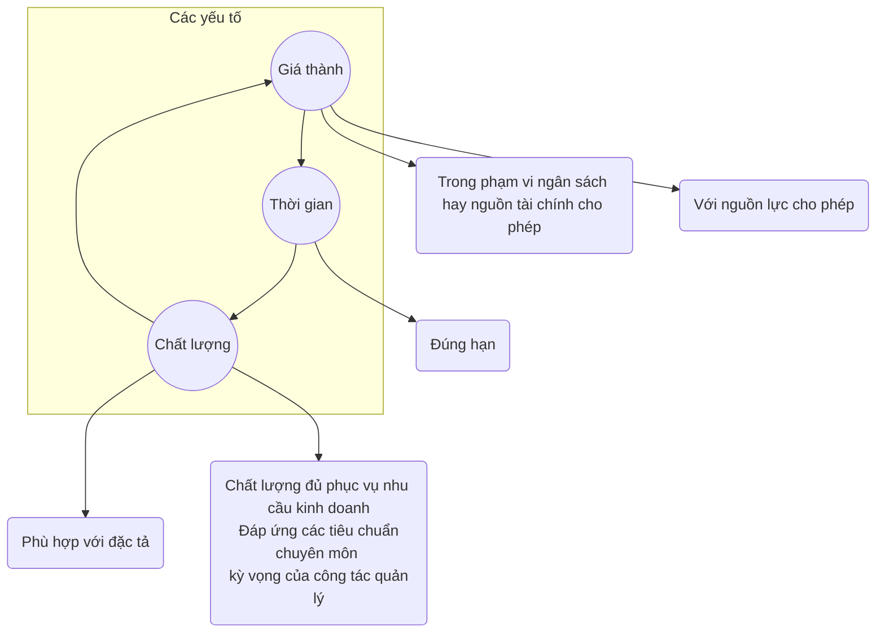
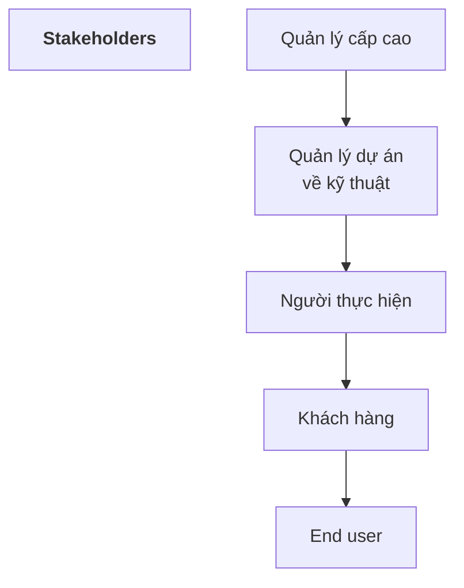
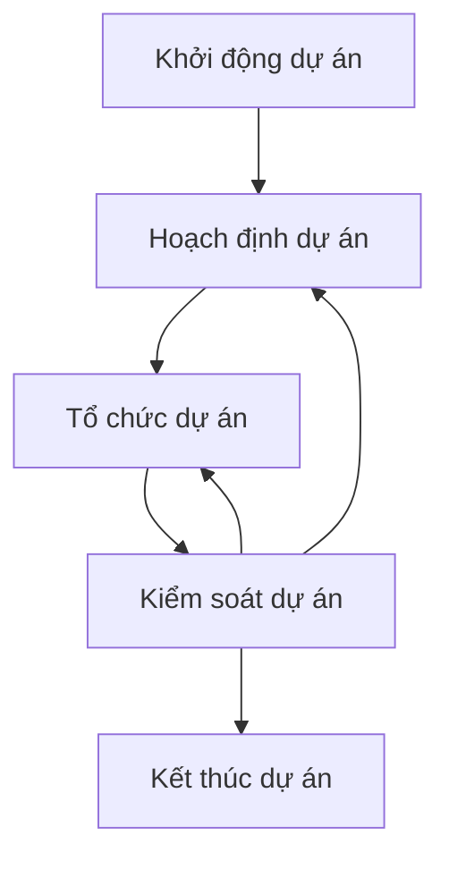

## 1. Khái niệm chung
### 1a. Giới thiệu - định nghĩa
> ***DỰ ÁN (Project)*** - một công việc có thời hạn nhằm tạo ra một sản phẩm, dịch vụ hay kết quả duy nhất

* **Tính thời hạn (Temporariness)** : có điểm bắt đầu, kết thúc

* **Tính duy nhất (Uniqueness)** : 
	* Dự án là riêng biệt, độc lập
	* Có sản phẩm cụ thể cuối cùng
	* Sản phẩm/Môi trường dự án là duy nhất
	* Mang lại yêu tố mới cho đội ngữ thực hiện

👉 *Dự án cần được quản lý với giả định sẽ xảy ra thay đổi*

***Các lĩnh vực trong quản lý dự án***

![[Pasted image 20221031144002.png]]

> ***DỰ ÁN PHẦN MỀM***

* Do đội ngũ thành viên gồm **ít nhất 2 người thực hiện**

* **Giới hạn** về thời gian, ngân sách và nhân lực

* Sản phẩm là phần mềm **mới** hoặc **có sẵn được cải tiến**

* Sp góp phần tạo dựng quy trình nghiệp vụ mới, hữu ích hoặc mang lại lợi ích đáng kể cho quy trình nghiệp vụ hiện có.

> ***QUẢN LÝ DỰ ÁN*** - áp dụng kiến thức, kỹ năng, công cụ và kỹ thuật vào các hoạt động dự án -> đáp ứng yêu cầu của dự án

* Yêu cầu của dự án 👷‍♂️:
	* Đạt mục tiêu dự án
	* Đạt hoặc vượt các yêu cầu, kỳ vọng của stakeholders
	* Cân bằng: tgian -- chi phí -- sản phẩm



***Các nhiệm vụ trong quản lý dự án***

![[Pasted image 20221031150821.png]]

### 1b. Yếu tố con người



* ***Quản lý cấp cao*** : xác định vấn đề nghiệp vụ, thường có ảnh hưởng lớn tới dự án
* ***Quản lý dự án (kỹ thuật)*** : lên kế hoạch, động viên, tổ chức và kiểm soát những người thực hiện phần mềm
* ***Người thực hiện*** : có kĩ năng kỹ thuật cần thiết để thiết kế sản phẩm hoặc ứng dụng.
* ***Khách hàng*** : đưa ra các yêu cầu cho phần mềm được thiết kế
* ***Người sử dụng cuối cùng*** : người tương tác với phần mềm khi nó được phát hành.

![[20221031_152411.jpg]]

#### Team Leader

```
MOTIVATION -- ORGANIZATION -- IDEAS OR INNOVATION
```
- ***Motivation*** : khả năng khích lệ nhân viện kỹ thuật để tạo ra sản phẩm với khả năng tốt nhất.
- ***Organization*** : khả năng định hình quá trình hiện có (phát minh cái mới), để có thể từ ban đầu tạo ra sp cuối cùng.
- ***Ideas or Innovation*** : khả năng khuyến khích mọi người tạo ra hoặc sáng tạo, kể cả khi bị giới hạn đã được thiết lập của dự án.

#### Project Manager

![[Pasted image 20221031153553.png]]

* **là tâm điểm giao tiếp**
* Biết chu kỳ sống của dự án, các tiến trình của dự án và vai trò của tiến trình này trong việc thực hiện các công việc ở các pha khác nhau trong chu kỳ sống của dự án.
* Nhận biết được sự phức tạp của môi trường thực hiện dự án.
* Phải được chuẩn bị để **đối phó với các xung đột khác nhau**.

#### Các mô hình tổ chức/giao tiếp (Communication issues)

* ***Mô hình đóng*** - cấu trúc một nhóm với sự phân quyền truyền thống

* ***Mô hình ngẫu hứng*** - cấu trúc một nhóm lỏng lẻo, phụ thuộc vào sáng kiến cá nhân của mỗi thành viên

* ***Mô hình mở*** - cố gắng cấu trúc một nhóm mà cách thi hành = mô hình chặt chẽ + mô hình ngẫu hứng

* ***Mô hình đồng bộ*** - dựa trên sự phân chia tự nhiên của một vấn đề và các thành viên trong nhóm làm việc **trên các thành phần của vấn đề** đó với **ít sự giao tiếp lẫn nhau giữa các thành phần** của vấn đề.

#### Phối hợp và giao tiếp nhóm

* Chính thức, tiếp cận cá nhân:

* Chính thức, thủ tục giao tiếp cá nhân:

* Không chính thức, thủ tục giao tiếp cá nhân:

* Giao tiếp điện tử:

* Mạng lưới giao tiếp cá nhân: 

### 1c. Yếu tố sản phẩm
#### Phạm vi sản phẩm
1. ***Hoàn cảnh*** : làm thế nào để pm được xây dựng phù hợp với hệ thống, sản phẩm hoặc hoàn cảnh kinh doanh lớn hơn, và các rằng buộc nào của hoàn cảnh.

2. ***Mục tiêu thông tin*** :  khách hàng thấy được sp đầu ra của pm là gì? Dữ liệu yêu cầu input là gì?

3. ***Chức năng và hiệu suất*** : chức năng nào của pm thực hiện biến đổi input -> output? Tất cả trường hợp riêng đặc biệt đều được giải quyết?

* Phạm vi dự án pm phải rõ ràng và dễ hiểu tại mỗi mức quản lý và chuyên môn.

#### Phân tách vấn đề
* Hay còn đc gọi là **sự phân hoạch** hoặc **giải thích vấn đề**

* Khi phạm vi được xác định:
	* Nó được phân ra thành các chức năng cấu thành
	* Nó được phân ra  thành đối tượng dữ liệu người dùng có thể thấy
	* Nó được chia thành một tập các lớp vấn đề

* Quá trình phân hoạch tiếp tục đến khi tất cả các chức năng hoặc các lớp vấn đề đã được xác định

## 2. Quy trình quản lý dự án
### 2a. Tổng quan


![[Chap4_tongquan.png]]

#### Work Breakdown Structure - WBS
> [!info]
> Sơ đồ, biểu đồ giúp biểu diễn sự phân rã các chức năng từ tổng thể -> chi tiết

> [!note] Ký pháp
> * Mỗi **nút chứng năng**: hình vuông chứa tên chức năng
> * **Cung** thể hiện bao hàm: đường nối 
- Cấu trúc cây phân cấp
- Các nút trên cây là các mức phân rã công việc
- Các nút lá là các task cụ thể:
	- Sản phẩm
	- Thời hạn hoàn thành
	- Tiêu chí
	-> Giao việc

![[20221107_145708.jpg]]

#### Giải quyết bài toán quản lý dự án

![[Pasted image 20221031164939.png]]

#### Sàng lọc dự án
* Tập trung vào sự đa dạng của các thành viên trong nhóm và độ phức tạp của công việc:
	* Xem xét các sự việc khác nhau ở các góc độ khác nhau, xuất phát từ thành viên và các công việc cần làm
	* Sử dụng quy trình: Plan - Do - Check - Act
	* Tìm ra năng lực của các thành viên và tận dụng đầy đủ các năng lực đó.

![[Pasted image 20221107104539.png]]

#### Các pha quản lý dự án

* Một dự án sẽ có quá trình thực thi phức tạp, với nhiều giai đoạn và quá trình

* Bên thực hiện sẽ phải tuân thủ tuyệt đối vòng đời nghiệp vụ, từ việc định nghĩa, chứng minh tính khả thi, cho đến khi phân bổ lợi ích cho doanh nghiệp.

* Các kĩ năng quản lý dự án là rất cần thiết từ ban đầu: 
	* Hiểu biết rõ về các quy trình của dự án
	* Ước tính đáng tin cậy
	* Lập, xem xét kế hoạch dự án một cách cẩn thận

* Các lĩnh vực và quy trình bổ trợ làm giúp đảm bảo lòng tin rằng dự án sẽ tạo ra một kết quả có giá trị.

![[Pasted image 20230306163605.png]]

> [!note] Pha *Định Nghĩ và thiết kế dự án*
> Khái niệm, mục tiêu, cách tiếp cận và cách biện minh rằng một dự án đã được định nghĩa đúng, được đồng ý và được truyền đạt đúng.

> [!note] Pha *Lập kế hoạch quản lý*
> * Sơ lược kế hoạch quản lý tổng thể, trong đó xác định, lập dự toán và thời gian thực hiện cho các tài nguyên có sẵn, mua lại hay hợp đồng con
> * Đánh giá lại nghiệp vụ để đảm bảo là các giả định và biện minh ban đầu vẫn đúng
> * Xác định chi tiết và chủ định thực hiện các tiến trình quản lý.

* Mỗi dự án có thể trải qua nhiều giai đoạn, mỗi giai đoạn có mục tiêu và kết quả cần đạt khác nhau.

* Các giai đoạn thường yêu cầu các kỹ năng, cấu trúc và mức độ tài nguyên khác nhau, việc lập kế hoạch, ước lượng chi phí và phân bổ TN cho từng giai đoạn là bình thường.

> [!note] Pha *Kết thúc dự án*
> * Lợi ích theo kế hoạch sẽ được đánh giá và theo dõi trong suốt dự án.
> * Tối ưu hoá lợi ích là một trong số các mục tiêu chính của người quản lý dự án.
> * Chuyển giao công việc, quy trình, kết quả cần đạt cho các bộ phận chuyên ngành
> * Nộp hồ sơ, tài liệu đúng hạn, đầy đủ chi tiết về hoạt động cũng như quá trình kiểm tra giám sát dự án, đây là cơ sở để bảo trì và phát triển dự án trong tương lai.
> * Giải phóng nhân lực, thiết bị và phương tiện.

> [!tip] Rà xét việc thực hiện dự án
> * Đánh giá mức độ thành công của dự án.
> * Xác định các mục tiêu cần cải tiến.
> * Rút ra bài học kinh nghiệm.

### 2b. Ước lượng dự án
#### Định nghĩa
> Ước lượng các nguồn lực, chi phí và lịch trình cho một nỗ lực kỹ thuật phần mềm yêu cầu.

🫳<b>YÊU CẦU</b>: 
- Kinh nghiệm 
- Khả năng tiếp cận thông tin, số liệu tốt
- Dám cam kết dự đoán định lượng khi chỉ tồn tại các thông tin định.

* Ước lượng mang nguy cơ tiềm tàng và rủi ro này dẫn đến sự không chắc chắn.

#### Các nguồn lực

![[Pasted image 20221107144333.png]]

#### Phạm vi dự án
* Phạm vi pm:
	* Các tính năng sẽ được chuyển giao cho người dùng cuối
	* Các dữ liệu input và output
	* Các nội dung được trình bày cho người sử dụng như 1 hệ quả của việc sử dụng pm.
	* Hiệu quả hoạt động, ràng buộc, giao diện và độ tin cậy gắn với hệ thống.

* Được mô tả bằng 2 kỹ thuật:
	* **Một mô tả tường thuật của mô mềm** được phát triển sau khi giao tiếp với tất cả các bên liên quan.
	* **Một tập hợp các use-case** được phát triển bởi người dùng đầu cuối.

#### Các kĩ thuật ước lượng
* **Kinh nghiệm** từ các dự án tương tự

* Các kt thông thường
	* Phân tích công việc, ước tính công sức [[Chap4 - Quản lý dự án#Work Breakdown Structure - WBS]]
	* Mô hình thực nghiệm
	* Đánh giá kích thước

* Các công cụ tự động

#### Độ chính xác ước lượng 🎯
Dự đoán dựa trên ...
* Mức độ mà các kế hoạch đã ước tính đúng đắn các **kích thước của sản phẩm** được xây dựng

* Khả năng chuyển đổi các ước tính kích thước vào **công sức con người, thời gian và tiền của** (Một chức năng có được nhờ sự sẵn có của số liệu phần mềm đáng tin cậy từ các dự án trước)

![[20221107_151351.jpg]]

* Mức độ mà các kế hoạch dự án phản ánh **khả năng của nhóm phần mềm**.

* **Sự ổn định của yêu cầu** sản phẩm và môi trường hỗ trợ kỹ thuật phần mềm.

### 2c. Lập kế hoạch dự án

👉 <span style="color:yellow"><b>Mục tiêu</b></span>: thiết lập/xây dựng một chiến lược mang tính thực tiễn cho kiểm soát, theo dõi, giám sát việc thực hiện dự án pm.

![[Pasted image 20221107144810.png]]

*  ***Lý do khiến cho Prj bị trễ hạn:*** ⌛
	* Thiếu hụt nhân lực, tài nguyên
	* Deadline không thực tế
	* Sự thay đổi yêu cầu của khách hàng
	* Không dự kiến các khó khăn về kỹ thuật, con người
	* không có kế hoạch quản lý rủi ro

#### Phân phối nhân lực
![[Pasted image 20221107153434.png]]

#### Xác định các nhiệm vụ
* Xác định loại project:
	* Tên, nội dung
	
	* Các ước tính về tgian
	
	* Mối quan hệ với các nhiệm vụ khác

![[Pasted image 20221107154351.png]]

* Đánh giá các mức độ yêu cầu

* Xác định các tiêu chí tưng ứng 

**Task**:
* ES - thời điểm bắt đầu sớm nhất
* EF - thời điểm kết thúc sớm nhất
* LS - thời điểm bắt đầu muộn nhất
* LF - thời điểm kết thúc muộn nhất

* Chọn pm thích hợp và các nhiệm vụ kỹ thuật

#### Xác định một mạng lưới các nhiệm vụ
![[Pasted image 20221107154720.png]]

#### Biểu đồ Gantt (biểu đồ thời gian)
![[Pasted image 20221107154806.png]]

#### Lập kế hoạch, theo dõi, báo cáo
![[Pasted image 20221107161700.png]]

### 2d. Quản lý rủi ro dự án

> [!info] Rủi ro
> - Những sự kiện có thể làm phá vỡ một dự án
> - Những điều không chắc chắn, những khoản nợ hay những điểm yếu có thể làm cho dự án không đi theo đúng kế hoạch đã định.

> [!question] Tại sao cần quản lí rủi ro
> - Tất cả các dự án đều phụ thuộc vào rủi ro
> - Tiến trình sẽ không đúng theo kế hoạch trong một số giai đoạn của dự án.

> [!check] Lợi ích của quản lí rủi ro:
> * giảm thiểu thiệt hại/ảnh hưởng của các sự cố không biết trước cho dự án
> * Nâng cao xác suất thực hiện thành công dự án
> * Tạo ra ý thức kiểm soát
> * Giải pháp kịp thời.


![[20221107_162157.jpg]]

**Khi nào cần quản lí rủi ro**
* Lập kế hoạch quản lý
* Dự án sẵn sàng thực thi
* Khôi phục một dự án đã bỏ dở
* Khi rà xét dự án
* Khi có sự sai lệch lớn so với kế hoạch xảy ra.

#### Xác định rủi ro
* **Kích thước sp**: gắn liền với kích thước tổng thể của pm

* **Tác động kinh doanh**: quy trình nghiệp vụ

* **Đặc điểm của khách hàng**: trình độ sử dụng của khách hàng

* **Định nghĩa quá trình**:

* **Môi trường phát triển**: gắn liền với các công cụ để xây dựng sp

* **Công nghệ sử dụng**:

* **Số lượng nhân viên và kinh nghiệm**:

#### Đánh giá rủi ro dự án
> xem xét các thành phần cấu thành nên rủi ro đấy.

* Phân tích rủi ro: xác định các thành phần

* Xác định xác suất xảy ra của rủi ro
* Tác động của rủi ro.
-> Xác định mức của rủi ro (risk level)

**Các thành phần rủi ro**

![[Pasted image 20221107130312.png]]

#### Kiểm soát rủi ro
![[Pasted image 20221107163532.png]]

#### Dự phòng rủi ro

> [!info] Phép chiếu rủi ro (Ước lượng rủi ro)
> Đánh giá bằng hai cách:
> * Khả năng hoặc xác suất rằng rủi ro xảy ra
> * Hậu quả có thể xảy ra của các vấn đề liên quan với rủi ro

> [!note] 4 bước dự phòng rủi ro
> 1. Thiết lập phạm vi phản ánh khả năng của một rủi ro mà ta nhận thấy được
> 2. Vạch ra các hậu quả của rủi ro.
> 3. Ước tính tác động của rủi ro lên dự án và sản phẩm
> 4. Ghi nhớ về tính chính xác toàn bộ của dự phòng rủi ro để không có hiểu lầm xảy ra.

#### Xây dựng bảng rủi ro
![[Pasted image 20230306175526.png]]
* *Tác động* của dự án trên thang điểm từ 1 - 5:
	* 1 = ít ảnh hưởng đến thành công của dự án
	* 5 = tác động thảm khốc đến thành công của dự án
* Sắp xếp bảng theo xác suất và tác động

* Mức độ rủi ro tổng cộng (Risk Exposure - RE) được xác định bằng công thức:
$$
RE = P * C
$$
	- P là xác suất xảy ra đối với 1 rủi ro
	- C là chi phí cho dự án nếu rủi ro xảy ra

> [!example] Ví dụ

![[Pasted image 20230306222529.png]]

#### Giảm nhẹ rủi ro, giám sát, quản lý
> [!question] Làm thế nào để ngăn ngừa rủi ro?

> [!question] Những yếu tố có thể theo dõi, cho xác định khả năng của rủi ro tăng lên hay giảm xuống?

> [!question] Những kế hoạch dự phòng gì cho trường hợp rủi ro trở thành hiện thực?

#### Quy trình quản lý rủi ro
Giảm thiểu tối đa ảnh hưởng của những sự cố không biết trước cho dự án bằng cách xác định và đưa ra những giải pháp tình huống trước khi có những hậu quả xấu xảy ra.

![[Pasted image 20230306224144.png]]


![[20221107_164219.jpg]]