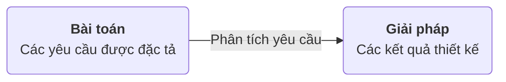

> [!info] Mô hình yêu cầu phần mềm phân tích có cấu trúc (Structured analysis)
> Xem xét, phân tích yêu cầu theo dữ liệu giữa các tiến trình và sự thay đổi dữ liệu như các thực thể riêng biệt.
> * Data obj được mô hình bằng định nghĩa các trạng thái và quan hệ giữa chúng
> * Các tiến trình thao tác đối với dữ liệu đối tượng được mô hình để  cho thấy làm thế nào biến đổi dữ liệu như dữ liệu đối tượng thông qua hệ thống.

> [!info] Mô hình yêu cầu phần mềm phân tích hướng đối tượng (OO analysis)
> Tập trung vào :
> * Định nghĩa các lớp 
> * Cách thức mà chúng liên kết với nhau để thực hiện các yêu cầu của khách hàng.


* 3 khía cạnh khi thực hiện yêu cầu cần quan tâm:![[Chap6.1 - Kỹ nghệ yêu cầu phần mềm#^38d7d3]]
* Phân tích yêu cầu:
	* Phân rã các yêu cầu thành các nhân tố chính cùng mối quan hệ giữa chúng là cơ sở để xây dựng giải pháp cho pha thiết kế.



![[20221205_144928.jpg]]

![[20221205_145323.jpg]]

![[20221205_145607.jpg]]

## 2. Một số mô hình thực tế
### a. Biểu đồ luồng (Flow-Oriented Modeling)
> [!info] Flow-Oriented Modeling
> Trình diễn cách thức dữ liệu đối tượng được biến đổi thông qua hệ thống DFD [[Chap6.1 - Kỹ nghệ yêu cầu phần mềm#Biểu đồ luồng dữ liệu - Data Flow Diagram (DFD)]]

* Là cách tiếp cận theo trường phái cũ, tuy nhiên cách thức vẫn cung cấp một khía cạnh của hệ thống nên vẫn được sử dụng để bổ sung cho các mô hình phân tích khác. 

* Mỗi hệ thống máy tính, về cơ bản, là một hệ thống biến đổi thông tin
	![[Pasted image 20230307013353.png]]


```start-multi-column
ID: ID_z4bl
Number of Columns: 2
Largest Column: standard
border: off
```

![[Pasted image 20230307013423.png]]

--- column-end ---

* **Thực thể ngoài** - nguồn sản xuất hoặc tiêu thụ dữ liệu
	* VD: người, thiết bị cảm biến, hệ thống máy tính cơ bản.

> [!warning] Dữ liệu luôn luôn phải xuất phát từ một nơi nào đó và luôn phải được gửi đên một cái gì đó

* **Luồng dữ liệu** thông qua một hệ thống, bắt đầu như đầu vào và biến đổi thành đầu ra

* **Kho dữ liệu** - các dữ liệu được  lưu lại chô lần sử dụng sau

=== end-multi-column


![[Chap6.1 - Kỹ nghệ yêu cầu phần mềm#^eef0d4]]

![[Pasted image 20230307014140.png]]

### b. Đặc tả tiến trình (PSPEC)
![[Pasted image 20221205150041.png]]

### c. Mô hình hành vi
> [!info] Mô hình hành vi
> Tương tác, phản ứng của phần mềm khi nhận các sự kiện từ bên ngoài

#### Mô hình Usecase
* Use case là gì?
![[2. UML & use case diagram#Use Cases]]

>[!note] Usecase Model
>* Yêu cầu chức năng:
>	* Use-case Diagram
>	* Đặc tả Usecase
>* Yêu cầu phi chức năng:
>	* Đặc tả phụ trợ
>	* Bảng chú giải

* Tác nhân (Actors):
![[2. UML & use case diagram#Actors]]

* Các mối quan hệ (relation):
	* Liên kết: Actor - Usecase
	* Kế thừa
	* Include: gọi tới, bao hàm, bao chứa
	* Extend: điểm mở rộng, gọi tới khi thoả mãn điều kiện

![[20221205_153622.jpg]]![[UseCase Diagram0.png]]

#### Biểu đồ trình tự - Sequence Diagram 
* Và biểu đồ giao tiếp

Ex:
![[Pasted image 20221205161936.png]]

#### Biểu đồ trạng thái - State Diagram
Ex: Biểu đồ trạng thái cho các lớp ControlPanel
![[Pasted image 20221205161805.png]]


## 3. Mô hình cho mô hình các yêu cầu
> [!info] Mô hình phần mềm
> Một cơ chế để thu nhận tri thức mà cho phép nó được áp dụng lại khi xuất hiện một vấn đề mới
> * Miền kiến thức có thể được áp dụng cho một vấn đề mới trong cùng miền ứng dụng
> * Các miền kiến thức được lưu lại bởi một mô hình có thể được áp dụng bằng cách tương tự vào một miền ứng dụng hoàn toàn khác.

### Khảo sát mô hình phân tích
* Các yếu tố cơ bản nhất trong mo tả của một mô hình yêu cầu là các use-case.
* Một tập hợp chặt chẽ các use-case có thể phục vụ là cơ sở cho việc phát triển một hoặc nhiều các mẫu phân tích thêm.

> [!info] Mô hình phân tích ngữ nghĩa (SAP)
> Mô hình mô tả một tập hợp nhỏ các use-case mạch lạc theo cùng mô tả một ứng dụng cơ bản.

> [!example]
> ![[Pasted image 20221217162040.png]]
> ![[Pasted image 20221217162049.png]]

## 4. Mô hình yêu cầu cho Web Apps
> [!note] Phân tích nội dung:
> Đầy đủ các nội dung được cung cấp bởi các Web App được xác định, bao gồm cả văn bản, đồ hoạ và hình ảnh, video, âm thanh và dữ liệu.
> -> Mô hình hoá dữ liệu có thể được sử dụng để xác định và mô tả một trong các dữ liệu đối tượng.

> [!note] Phân tích tương tác:
> Cách thức mà người dùng tương tác với các Web App được mô tả chi tiết
> -> Use-Case Diagram có thể được phát triển để cung cấp mô tả chi tiết cho tương tác này.

> [!note] Phân tích chức năng:
> Các use-case được tạo ra như một phần của phân tích tương tác xác định các hoạt động mà sẽ được áp dụng cho nội dung Web App và bao hàm các chức năng xử lý khác.
> **Tất cả các hoạt động và chức năng được mô tả chi tiết.**

> [!note] Phân tích cấu hình:
> Môi trường và cơ sở hạ tầng, trong đó vị trí của Web App được mô tả chi tiết.

> [!question] Khia nào tiến hành phân tích ?
> Một phân tích hoạt động rõ ràng xuất hiện khi:
> * Các Web App sẽ được xây dựng nhiều, hoặc phức tạp
> * Số lượng các bên liên quan lớn.
> * Số lượng kỹ sư Web và đóng góp khác quá lớn.
> * Các mục tiêu và đối tượng (được xác định trong quá trình lập) cho Web App sẽ ảnh hưởng đến "kinh doanh"
> * Sự thành công của các Web App sẽ có một ảnh hưởng mạnh mẽ tới sự thành công của doanh nghiệp

### Mô hình nội dung
* Đối tượng nội dung được lấy từ biểu đồ use-case
	* Kiểm tra các mô tả kịch bản để tham khảo trực tiếp và gián tiếp đến nội dung
* Các trạng thái (state) của một đối tượng nội dung được định nghĩa
* Các mối quan hệ giữa các đối tượng nội dung
	* Sơ đồ ERD [[Chap6.1 - Kỹ nghệ yêu cầu phần mềm#Sơ đồ thực thể liên kết - Entity Relation Diagram (ERD)]]
* Hệ thống thống phân cấp của nội dung được duy trì bởi một Web App
	* Cây phân cấp dữ liệu hoặc UML
	![[Pasted image 20221217164359.png]]

### Mô hình tương tác
> [!note] Các nguyên tố cấu thành
> * Use-case Diagrams
> * Sequence Diagrams
> * State diagrams
> * A user interface prototype

> [!example] Sequence Diagrams
> ![[Pasted image 20221217164613.png]]

> [!example] State Diagrams
> ![[Pasted image 20221217164645.png]]

### Mô hình chức năng
* Các mô hình chức năng giải quyết hai yếu tố xử lý của Web App
	* Khảo sát chức năng người dùng được phân phối bởi các Web App cho người dùng cuối.
	* Các hàm trong lớp thực hiện hành vi kết hợp với lớp.
* Một biểu đồ hoạt động có thể được sử dụng để biểu diễn luồng tiến trình.
![[Pasted image 20221217171904.png]]

### Mô hình cấu hình
* Server
	* Phần cứng máy chủ và môi trường HĐH phải được xác định
	* Cân nhắc khả năng tương tác trên phía máy chủ phải được xem xét
	* Giao diện thích hợp, giao thức truyền thông và thông tin hợp tác liên quan phải được quy định.

* Clients
	* Vấn đề cấu hình trình duyệt phải được xác định
	* Yêu cầu thử nghiệm cần được xác định.

### Mô hình điều hướng
* Đối với các yếu tố/trạng thái dễ dàng để đạt được (yêu cầu các bước chuyển hướng ít hơn) những người khác? Ưu tiên cho các trình diễn là gì?

* Một số yếu tố cần được nhấn mạnh để buộc người dùng điều hướng theo hướng của họ?

* Làm thế nào lỗi điều hướng cần được xử lý?

* Chuyển hướng tới các nhóm có liên quan cần được ưu tiên hơn hướng đến một yếu tố cụ thể.

* Chuyển hướng nên được thực hiện thông qua các liên kết, thông qua truy cập dựa trên tìm kiếm, hoặc bằng một số phương tiện khác?

* Các yếu tố có nhất định nên giới thiệu đến người dùng dựa vào bốicảnhcủa hành động chuyển hướng trước?

* Một bản ghi chuyển hướng nên được duy trì cho người sử dụng?

* Nên có một navigation map hoặc là menu ở mọi điểm trong sự tương tác của người dùng

* Thiết kế chuyển hướng nên được thúc đẩy bởi các hành vi sử dụng dự kiến phổ biến nhất hoặc bởi tầm quan trọng của các yếu tố nhận thức Web App?

* Có thể sử dụng một lưu trữ chuyển hướng trước đó thông qua các Web Apps để tiến hành sử dụng trong tương lai.

* Nhóm người dùng điều hướng tối ưu nên được thiết kế?

* Làm thế nào kết nối các đường link bên ngoài để các Web App được xử lý? 
	* Chồng lên các cửa sổ trình duyệt hiện hành
	* Mở một cửa sổ trình duyệt mới
	* Mở một khung riêng biệt