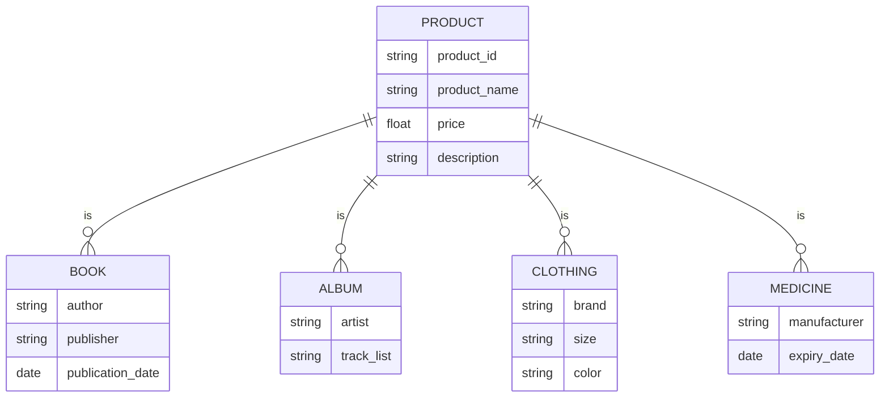

Thiết kế bằng mermaid Một hệ thống thương mại điện tử và các sản phẩm với các loại khác nhau. Các sản phẩm có các thông tin khác nhau: mã sản phẩm, tên sp, đơn giá, mô tả. Tuỳ vào từng loại sản phẩm thì có thêm các thông tin khác nhau (Tác giả, NXB, Ngày Xuất bản). Album thì có thêm thông tin về Nghệ sĩ, danh sách. Quần áo thì có thông tin về nhãn hiệu, kích thước, màu sắc. Thuốc thì có thêm hãng, hạn dùng. 
Câu hỏi: Hãy thiết kế mô hình dữ liệu cho bài toán trên (ERD, thiết kế csdl dùng csdl quan hệ)
1. Thiết kế CSDL sử dụng csdl quan hệ 
2. Trong hệ thống TMĐT thì tính năng tìm kiếm sản phẩm được sử dụng nhiều nhất, hãy viết câu lệnh truy vấn để có thể tìm kiếm các sản phẩm theo các thông tin chung của sản phẩm. Nhận xét khi câu truy vấn thực hiện rất nhiều lần thì có vấn đề gì xảy ra.



```shell
<1> Conceptual data modeling --> ERD
|
v
<2> Logical data modeling -- RDB:
							-- E -> Table (Normal form)
							-- R -> Reference
						  -- NoSQL:
							-- E -> Documents/Collection
							-- R 
								-> Reference
								-> Aggrefation
|
v
<3> Physical data modeling
```

