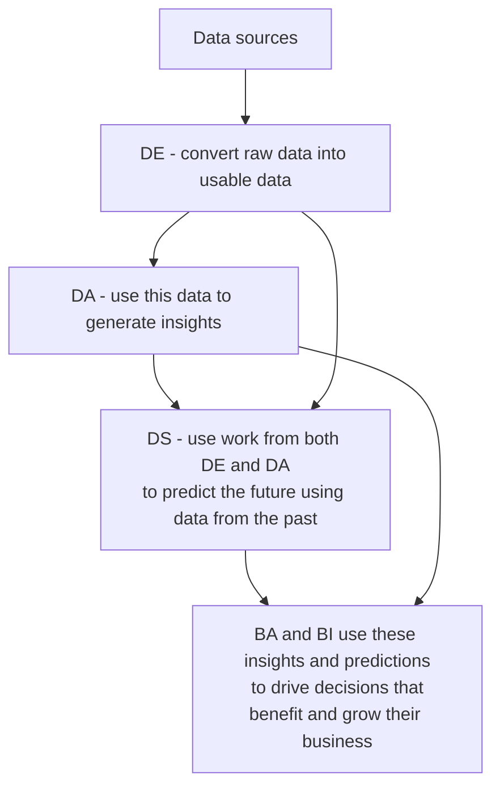

 * Orgs are using data to uncover opportunities and applying that knowledge in to the race with other competitors.

> [!abstract] Data Professionals
> * Data Engineer - DE
> * Data Analyst - DA
> * Data Scientist - DS
> * Business Analyst - BA
> * Business Intelligence Analyst - BI

## Data Engineer

```start-multi-column
ID: ID_jxju
Number of Columns: 2
Largest Column: left
border: off
```


> [!info] Data Engineer 
> * Build up and maintain **data architectures**
> * Make data available for **business operations** or **analysis**

--- column-end ---

![[Pasted image 20230308230139.png]]

=== end-multi-column

> [!question] How did they do that?
> > [!check] Answer
> > * Extracting, integrating and organizing data from disparate sources.
> > * Cleaning, transforming and preparing data.
> > * Designing, storing and managing data in data repos.

### Needed skills of a DE
* High level of programming

* Sound knowledge of systems and technology architectures.

* In-depth understanding of relational databases as well as the non-relation ones.

## Data Analyst 

```start-multi-column
ID: ID_cn32
Number of Columns: 2
Largest Column: right
border: off
```


![[Pasted image 20230308230724.png]]

--- column-end ---

> [!info] Data Analyst
> Translate complex data and numbers into simple language that orgs can make decisions depend on that.

=== end-multi-column

> [!check] Works of a DA
> * Inspecting and cleaning data from deriving insights.
> * Indentifying correlations, finding patterns and applying statisticall methods to analyse and mine data.
> * Visualizing data to interpret and present the findings of data analysis.

^c39adc

Example:
![[Pasted image 20230308235921.png]]

### Needed skills of a DA
* Good knowledge of spreadsheets, writing queries and using statistical tools to create charts and dashboards.

* Programming skills

* Strong analytical and story-telling skills

## Data Scientist

```start-multi-column
ID: ID_29db
Number of Columns: 2
Largest Column: right
border: off
```


![[Pasted image 20230309000313.png]]

--- column-end ---

> [!note] Works of a DS
> * Analyze data for actionable insights
> * Create predictive models using ML and Deep Learning

=== end-multi-column

Example:
 ![[Pasted image 20230309000515.png]]

### Needed skills of a DS
* Knowledge of Mathematics and Statistics

* Understanding of prog languages, db and building data models

* Have a fair knowledge of the domain that they are working on

## Business Analyst and BI Analyst

```start-multi-column
ID: ID_g82q
Number of Columns: 2
Largest Column: standard
border: off
```


> [!info] BA
> Leverage (tận dụng) the work of DA and DS to look at possible implications for their business and the actions they need to take or recommend.

--- column-end ---

> [!info] BI
> Do the same but:
> * Focus on market forces and external influences that shape their business
> * Organize and monitor data on different business functions
> * Explore data to extract insights and actionables that improve business performance.

=== end-multi-column



