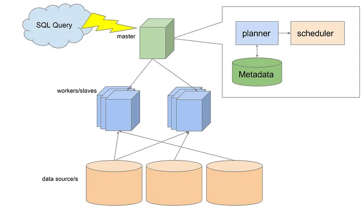

> [!question] Why do we need a Query Engine ?
> It helps to seperate storage and computate part, which will increase elasticity and scalability.

* Cluster will be in charge of translating SQL to execution plan, then distributing it among the slaves.

* **Metadata store** holds table, func which will be used by the **planner**.

## Storage
### HDFS
* Best performance (read/write latency)
### S3
* Not a file system but a object storage.

* Different behavior than HDFS

Ex: Renaming folder will act as copying of all files in the old path to the new path.

## File formats
There are 4 common file formats.

* **CSV**:
    - Readable
    - Slow read and write
    - Limited schema evolution

* **Avro**: 
    - suitable for row oriented data access.
    - Good schema evolution
    - Best use for serialization

* **Parquet, ORC**:
    - Slow to write, fast to read
    - Limited schema evolution
    - Widely used for big data.

## File Optimisation
* **Compression Format**: GZIP, SNAPPY, LZO ... choose between compression / read/write

* **File sizing**: one larger file >> many small files

* **Partitioning**: partition, hash partition, bucketed table
    - hash partition: devide a large table into smaller partitions based on a hash function applied to a specific columm.
    - bucketed table: each bucket or group of data is stored in one or more file (Hive), file name is derived from hash of bucketing column val.

* **Pre-sorting**: improve both compression and query performance

## Some Query Engines
### Hive
* Does not support ANSI SQL (use HiveQL)
### Trino (replacement for Presto)
* Used to query at PB scale

* Processing in memory and pipeline across the network. 

* Have many connectors (Cassandra, Hive, Kafka, MongoDB, MySQL) and clients (OBDC, JDBC,...)

### Spark SQL
* On top of Spark Core

* SQL queries will be executed by Spark core (ask Spark Job)

* Follow Hive syntax and support Hive metadata store.
### Snowflake
* SaaS product

* Smart caching helps boost performance

* Spill to S3

